# Dora Rust Workspace 参考文档

## 1. 一页式项目摘要

| 维度 | 结论 |
| --- | --- |
| 项目形态 | Rust workspace，而不是单一 crate。根 `Cargo.toml` 同时管理 Rust API、proc-macro、FFI、扩展库、binaries、examples 与多语言绑定。 |
| 文档焦点 | 以可复用 Rust crate 为主：`dora-node-api`、`dora-operator-api`、`dora-operator-api-macros`、`dora-operator-api-types`、`dora-core`、`dora-message`、`dora-arrow-convert`、`communication-layer-request-reply`、`dora-download`、`dora-tracing`、`dora-metrics`、`dora-ros2-bridge`、`dora-ros2-bridge-msg-gen`。 |
| 主要使用者 | 1. 编写节点的应用开发者。 2. 编写 operator 的二开开发者。 3. 负责发布、兼容性与质量门禁的 crate maintainer。 |
| 技术特征 | `async + sync` 并存、Arrow 数据格式、共享内存零拷贝路径、proc-macro、FFI、动态库装载、条件编译、ROS2 扩展、OpenTelemetry 遥测。 |
| 主公开入口 | 节点侧首选 `dora-node-api::DoraNode` 与 `dora-node-api::EventStream`；operator 侧首选 `dora-operator-api::DoraOperator`、`dora-operator-api::DoraOutputSender` 与 `register_operator!`。 |
| 基线版本 | workspace `version = "0.5.0"`，`rust-version = "1.85.0"`，但 `dora-message` 独立版本为 `0.8.0`。 |
| 兼容性敏感面 | re-export facade、`DoraOperator` trait、`Event` / `StopCause` 的非穷尽枚举、`dora-operator-api-types` FFI ABI、默认 feature、`dora-message` 独立版本与 `check_version_compatibility`。 |
| 已确认的 `unsafe` 重点 | `dora-node-api` 的共享内存映射与 Arrow buffer 封装；`dora-operator-api` / `dora-operator-api-types` 的 raw FFI、裸指针转换、Arrow FFI；`dora-operator-api-macros` 在 Windows 上写入 `.drectve` 导出段。 |
| docs.rs 现状 | 目前明确配置 `[package.metadata.docs.rs]` 的是 `communication-layer-request-reply`。其余目标 crate 未在 manifest 中显式配置 docs.rs 构建参数。 |
| 测试与质量门禁 | CI 覆盖 `cargo check/build/test`、examples、clippy、rustfmt、license、cross-check、MSRV；但未见 `cargo doc`、`cargo-semver-checks`、`cargo-audit`、`cargo-deny` 门禁。 |
| 非目标 | 这份文档不把 Dora 当作在线服务去写，不讨论 SLO、值班、告警与线上 Runbook；`binaries/*` 只作为 Rust 库使用上下文出现。 |

## 2. 文档目录框架

1. 一页式项目摘要
2. 文档目录框架
3. 文档 tree
4. Mermaid 图清单
5. AI 代码索引输出策略摘要
6. 第一部分：面向开发者
7. 第二部分：面向维护者
8. 第三部分：面向 AI 的代码索引卷
9. 附录

## 3. 文档 tree

```text
dora-rust-workspace-reference.md
├─ 一页式项目摘要
├─ 文档目录框架
├─ 文档 tree
├─ Mermaid 图清单
├─ AI 代码索引输出策略摘要
├─ 第一部分 面向开发者
│  ├─ 项目定位与快速开始
│  ├─ workspace 与 crate 结构
│  ├─ 公开 API 与特性矩阵
│  ├─ 错误模型 使用流程 unsafe 性能 测试 扩展
│  └─ 源码阅读建议 技术债 易踩坑
├─ 第二部分 面向维护者
│  ├─ Cargo 元数据与兼容性
│  ├─ docs.rs CI 依赖 平台
│  ├─ 弃用 安全 发布流程
│  └─ 维护风险与交接建议
├─ 第三部分 面向 AI 的代码索引卷
│  ├─ 索引范围与全量地图
│  ├─ 文件级总表 详细卡 符号级索引
│  ├─ re-export feature cfg 热点 测试 example CI
│  └─ 查询路由 机器可读导出 质量要求
└─ 附录
   ├─ ADR 设计决策索引
   ├─ 术语表 Feature Matrix 平台支持矩阵
   ├─ 关键源码证据清单 FAQ Troubleshooting
   └─ 待确认项 文档缺口 Top 10
```

## 4. 需要生成的 Mermaid 图清单

1. 文档结构图：mindmap
2. crate / workspace 结构图：flowchart
3. 公共 API 关系图：flowchart
4. feature 依赖图：flowchart
5. 关键使用流程时序图：两个 sequenceDiagram
6. build / test / docs / release 流程图：flowchart
7. 兼容性 / 迁移流程图：flowchart
8. unsafe / 条件编译边界图：flowchart
9. crate / module / file 映射图：flowchart
10. 文件级依赖图：flowchart
11. feature / cfg 到文件影响图：flowchart

## 5. AI 代码索引输出策略摘要

| 维度 | 策略 |
| --- | --- |
| 索引目标 | 面向 AI、RAG、代码问答代理、自动化分析脚本，优先回答“入口在哪里”“某个符号在哪定义”“哪个 feature 影响哪些文件”“先看哪几个文件”。 |
| 文件级索引 | 以仓库相关 Rust 代码与支撑配置为索引范围，当前机器导出覆盖 `361` 个文件记录，稳定字段见 `docs/dora-rust-workspace-ai-index.schema.yaml`。 |
| 符号级索引 | 对可识别的 public struct / enum / trait / function / type alias / re-export 建立索引，当前机器导出覆盖 `789` 条 `symbol_record`。 |
| feature / cfg 索引 | 对 manifest `features`、源码 `cfg(feature = ...)`、`cfg(target_...)`、docs.rs metadata 做单独抽取，既回写到 Markdown，也写入 JSONL 的 `feature_flags` 与 `cfg_conditions`。 |
| 依赖与跳转 | 文件记录保留 `depends_on_files` / `depended_by_files` 的轻量静态关系；核心文件在正文里补“建议阅读前置文件”“相关文件”“典型查询”。 |
| 机器可读导出 | `docs/dora-rust-workspace-ai-index.jsonl` 作为全量索引载体；`docs/dora-rust-workspace-ai-index.schema.yaml` 作为稳定字段模板。 |
| 事实边界 | 自动索引对 `used_by_files`、跨 crate 调用图、宏展开后符号只做保守记录；无法从源码静态确认的关系统一在正文标为 `【待确认】`。 |
| 文档与索引分工 | 主文档负责解释、优先级、风险和阅读建议；JSONL 负责“每个文件至少出现一次”的全量覆盖与稳定检索字段。 |

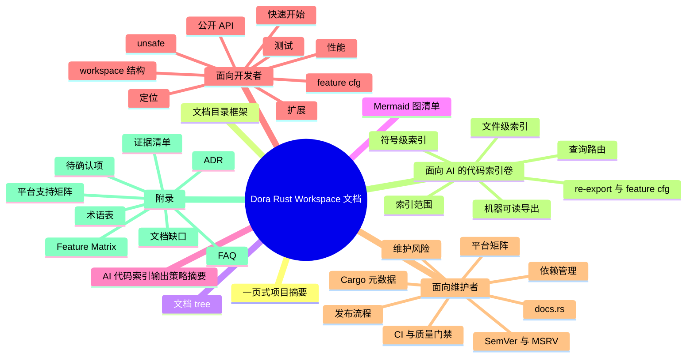

# 第一部分：面向开发者

## 1. 项目定位、使用场景、非目标、术语

### 1.1 项目定位

从 Rust 源码看，Dora 的 Rust 部分不是“一个 API 包”，而是一条分层很明确的 crate 链：

- `dora-node-api` 面向编写节点进程，负责初始化、收事件、发输出、集成测试与节点级遥测。
- `dora-operator-api` 面向编写 operator 动态库，负责 trait 抽象、事件转换、输出发送以及宏导出。
- `dora-core` 与 `dora-message` 负责配置描述、协议消息、ID、元数据、主题与构建辅助。
- `dora-arrow-convert` 负责 Arrow 与 Rust 类型之间的桥接。
- `communication-layer-request-reply`、`dora-download`、`dora-tracing`、`dora-metrics`、`dora-ros2-bridge` 提供可选扩展能力。

换句话说，Rust 使用者真正面对的是两条主线：

1. “节点主线”：`DoraNode` + `EventStream`。
2. “operator 主线”：`DoraOperator` + `register_operator!` + runtime 动态库 ABI。

### 1.2 适用场景

- 编写由 Dora daemon 启动的 Rust 节点。
- 编写由 runtime 装载的 Rust operator 动态库。
- 在 Rust 里消费或构造 Dora 的配置、消息格式与 Arrow 数据。
- 为 Dora 增加请求应答后端、遥测能力或 ROS2 集成。
- 为节点写“与真实运行方式一致”的集成测试。

### 1.3 非目标

- 不是 `no_std` crate 集合。已检索目标 crate，未发现 `#![no_std]`，并广泛依赖 `tokio`、`std::process`、`libloading`、共享内存与网络 IO。
- 不是脱离 Dora runtime/daemon 的通用 Arrow 框架。`dora-node-api` 明确依赖 daemon 环境变量、daemon 请求/回复与 event stream。
- 不是 runtime 无关的 operator ABI。`dora-operator-api` 的 raw FFI、`register_operator!` 生成符号和 `binaries/runtime` 的动态装载是成套设计。
- 【推断】不是以长期稳定的“所有 crate 都独立对外”策略设计。部分 crate 虽然公开，但更像支撑层或扩展层，而不是面向最终应用的第一入口。

### 1.4 关键术语

- `Dataflow`：一次运行的数据流实例，由 `DataflowId` 标识。
- `Node`：独立进程级执行单元，Rust 侧首选 `DoraNode`。
- `Operator`：由 runtime 装载的共享库单元，Rust 侧首选 `DoraOperator`。
- `DataId` / `NodeId` / `OperatorId`：配置与事件中的类型化标识。
- `Metadata`：输入输出附带的时间戳、类型信息和参数字典。
- `ArrowData`：`dora-arrow-convert` 提供的 Arrow 数组包装。
- `Dynamic node`：不由 `dora run` 自动拉起，而是手动用 `DoraNode::init_from_node_id` 启动的节点。
- `Integration testing`：通过 `setup_integration_testing` 或 `DoraNode::init_testing` 驱动的节点级测试模式。

对开发者的价值：先把“我应该看哪个 crate、哪个入口、哪些不是首要入口”说清楚，避免在 workspace 广度里迷路。  
关键源码证据：`Cargo.toml` workspace members；`apis/rust/node/src/lib.rs`；`apis/rust/operator/src/lib.rs`；`libraries/core/src/lib.rs`；`libraries/message/src/lib.rs`。  
待确认项：仓库是否存在面向外部用户的正式“稳定 crate 列表”说明，源码中未直接看到。  

## 2. 快速开始与最小可用示例

### 2.1 添加依赖

节点 crate 的最小依赖可以写成：

```toml
[dependencies]
dora-node-api = { version = "0.5.0", default-features = false }
eyre = "0.6"
```

如果你希望沿用当前默认体验，可直接启用默认 feature：

```toml
[dependencies]
dora-node-api = "0.5.0"
eyre = "0.6"
```

这会默认带上 `tracing` 与 `metrics` feature。源码证据来自 `apis/rust/node/Cargo.toml` 的：

- `default = ["tracing", "metrics"]`
- `tracing = ["dep:dora-tracing"]`
- `metrics = ["dep:dora-metrics"]`

operator crate 的最小依赖通常是：

```toml
[dependencies]
dora-operator-api = "0.5.0"
```

### 2.2 节点侧最小示例

```rust
use dora_node_api::{DoraNode, Event, IntoArrow};

fn main() -> eyre::Result<()> {
    let (mut node, mut events) = DoraNode::init_from_env()?;

    while let Some(event) = events.recv() {
        match event {
            Event::Input { id, metadata, data: _ } if id.as_str() == "tick" => {
                node.send_output("out".into(), metadata.parameters, 42_u32.into_arrow())?;
            }
            Event::Stop(_) => break,
            _ => {}
        }
    }

    Ok(())
}
```

这条路径和 crate-level docs 以及 `examples/rust-dataflow/node/src/main.rs` 一致：

- 初始化入口：`DoraNode::init_from_env`
- 事件入口：`EventStream::recv`
- 发送入口：`DoraNode::send_output`

### 2.3 operator 侧最小示例

```rust
use dora_operator_api::{
    DoraOperator, DoraOutputSender, DoraStatus, Event, register_operator,
};
use dora_operator_api::types::arrow::array::UInt8Array;

#[derive(Default)]
struct EchoOperator;

impl DoraOperator for EchoOperator {
    fn on_event(
        &mut self,
        event: &Event,
        output_sender: &mut DoraOutputSender,
    ) -> Result<DoraStatus, String> {
        if let Event::Input { .. } = event {
            output_sender.send("out".to_owned(), UInt8Array::from(vec![1_u8, 2, 3]))?;
        }
        Ok(DoraStatus::Continue)
    }
}

register_operator!(EchoOperator);
```

这段示例对应的真实 ABI 链路是：

- `register_operator!` 在 `apis/rust/operator/macros/src/lib.rs` 生成 `dora_init_operator`、`dora_drop_operator`、`dora_on_event` 三个导出符号。
- `binaries/runtime/src/operator/shared_lib.rs` 用 `libloading` 动态加载这三个符号。

### 2.4 哪个模块 / 类型是首选入口

- 节点开发首选：`dora_node_api::DoraNode`、`dora_node_api::EventStream`、`dora_node_api::Event`。
- operator 开发首选：`dora_operator_api::DoraOperator`、`dora_operator_api::DoraOutputSender`、`dora_operator_api::Event`、`register_operator!`。
- 配置与协议工具首选：`dora_core::descriptor`、`dora_core::config`、`dora_message::metadata`、`dora_message::common`。

### 2.5 哪些 feature 会影响最小示例

- `dora-node-api`：`default-features = false` 时，`init_tracing` 不再导出，metrics/tracing 的内部分支不启用，但 `DoraNode` / `EventStream` 主流程仍然可用。
- `dora-core`：默认无 feature；`build` 与 `zenoh` 是显式 opt-in。
- `dora-ros2-bridge`：默认启用 `generate-messages`；若关闭，`messages` 模块不会通过 `include!(env!("MESSAGES_PATH"))` 暴露。

对开发者的价值：给出两条“最短上手路径”，并明确默认 feature 是否会影响你拷贝示例后能否编译。  
关键源码证据：`apis/rust/node/src/lib.rs` crate docs；`apis/rust/node/src/node/mod.rs` 中 `init_from_env` / `send_output`；`examples/rust-dataflow/node/src/main.rs`；`apis/rust/operator/src/lib.rs`；`apis/rust/operator/macros/src/lib.rs`。  
待确认项：外部 crates.io 上当前可安装的精确版本与本仓库 `0.5.0` 是否已同步发布，需要以实际发布状态为准。  

## 3. Cargo / workspace / crate 结构地图

### 3.1 顶层结构

```text
.
├─ Cargo.toml
├─ Cargo.lock
├─ Changelog.md
├─ README.md
├─ LICENSE
├─ .github/workflows/
├─ apis/
│  ├─ rust/
│  │  ├─ node/
│  │  └─ operator/
│  ├─ c/
│  ├─ c++/
│  └─ python/
├─ libraries/
│  ├─ core/
│  ├─ message/
│  ├─ arrow-convert/
│  ├─ communication-layer/request-reply/
│  └─ extensions/
├─ binaries/
├─ examples/
└─ tests/
```

### 3.2 分层理解

- workspace root：成员编排、统一版本、统一 `rust-version`、共享依赖与 examples 容器 crate `dora-examples`。
- `apis/rust/*`：Rust 第一层公开 API。
- `libraries/*`：协议、配置、Arrow 转换、通信抽象与扩展能力。
- `binaries/*`：CLI、runtime、daemon、coordinator，主要作为 API 的运行环境与集成上下文。
- `examples/*`：公开 API 的最小路径与跨语言集成样例。
- `tests/*`：workspace 级端到端或回归案例。

### 3.3 优先阅读路径

建议第一次读源码按这个顺序：

1. 根 `Cargo.toml`
2. `apis/rust/node/src/lib.rs`
3. `apis/rust/node/src/node/mod.rs`
4. `apis/rust/node/src/event_stream/event.rs`
5. `examples/rust-dataflow/node/src/main.rs`
6. `apis/rust/operator/src/lib.rs`
7. `apis/rust/operator/src/raw.rs`
8. `apis/rust/operator/macros/src/lib.rs`
9. `apis/rust/operator/types/src/lib.rs`
10. `libraries/message/src/lib.rs`
11. `libraries/core/src/descriptor/mod.rs`

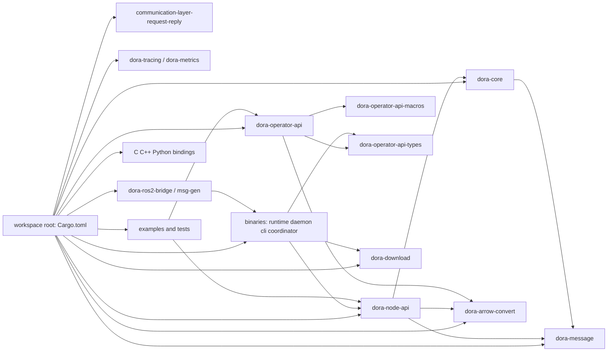

对开发者的价值：先看清 workspace 的“层”和“入口”，能显著降低读源码时把 binaries、绑定层和主 API 混在一起的成本。  
关键源码证据：根 `Cargo.toml` 的 `members`；`apis/rust/*/Cargo.toml`；`libraries/*/Cargo.toml`；`.github/workflows/ci.yml`。  
待确认项：是否存在 repo 外部的架构图或 ADR 文档解释这些层的长期边界，仓库内未直接看到。  

## 4. `src/lib.rs` 入口与导出策略

### 4.1 `dora-node-api`：明显的 facade

`apis/rust/node/src/lib.rs` 的导出策略非常典型：

- 直接暴露主入口：`DoraNode`、`DataSample`、`ZERO_COPY_THRESHOLD`、`EventStream`、`Event`、`StopCause`、`TryRecvError`。
- 直接 re-export 依赖：`arrow`、`flume`、`futures`、`serde_json`。
- 直接 re-export 支撑层：`dora_arrow_convert::*`、`dora_core::{self, uhlc}`、`dora_message::metadata::{Metadata, MetadataParameters, Parameter}`。
- 暴露低层工具：`arrow_utils`、`integration_testing`、`merged`。

这说明它不是“只包一层薄壳”，而是刻意把常用类型向 crate root 汇聚，减少使用者在 `dora-core` / `dora-message` / `arrow` 之间反复跳转。

### 4.2 `dora-operator-api`：trait facade 加宏入口

`apis/rust/operator/src/lib.rs` 暴露：

- `DoraOperator`
- `Event<'a>`
- `DoraOutputSender`
- `register_operator`
- `types`
- `DoraStatus`

这里的 facade 模式更强：Rust 用户通常只需要 `dora-operator-api` 一个依赖，但 ABI 的具体结构体都被放到 `dora_operator_api::types`。

### 4.3 `dora-message` 与 `dora-core`：面向工具链而非最终用户的 root

- `dora-message` 公开的是模块集合与协议基础类型：`common`、`config`、`metadata`、各类 `*_to_*` 消息模块，以及 `DataflowId`、`SessionId`、`BuildId`。
- `dora-core` 公开的是 `descriptor`、`metadata`、`topics` 与可选 `build` 模块，以及几个辅助函数如 `adjust_shared_library_path`、`get_python_path`。

它们更像“公共支撑层”，不是最终应用最先 import 的 crate。

### 4.4 re-export facade 专题

这个 workspace 的兼容性边界不只在“自定义类型”上，也在 re-export 上：

- `dora-node-api` re-export `arrow`、`flume`、`futures`、`serde_json`。
- `dora-operator-api` re-export `dora_arrow_convert::*` 与 `types`。
- `dora-message` re-export `tarpc`、`uhlc`、`arrow_data`、`arrow_schema`。
- `dora-core` re-export `config` 与 `uhlc`。
- `dora-ros2-bridge` 通过 `prelude` 再次 re-export `flume`、`futures`、`ros2_client`、`rustdds`、`tracing`。

这给使用者带来方便，也让 SemVer 更敏感：一旦换掉被 re-export 的依赖版本、路径或可见性，升级影响会远大于内部实现替换。

### 4.5 文档首页与导出结构的一致性

- `dora-node-api`：crate-level docs 与导出结构基本一致，首页就把 `DoraNode`、`EventStream`、动态节点与集成测试讲清楚。
- `dora-operator-api`：首页说明了 trait 和宏入口，但对 `types`、`raw`、ABI 边界的说明明显不足。
- `dora-core`、`dora-operator-api-macros`、`dora-operator-api-types`：当前公开面和 rustdoc 首页之间存在明显落差。
- `communication-layer-request-reply`：虽然功能还很小，但反而是少数显式考虑 `docsrs` 和 `doc_auto_cfg` 的 crate。

对开发者的价值：理解导出策略，就知道应该依赖哪个 crate root、哪些模块是“故意让你直接用”的，哪些只是被带出来的低层工具。  
关键源码证据：`apis/rust/node/src/lib.rs`；`apis/rust/operator/src/lib.rs`；`libraries/message/src/lib.rs`；`libraries/core/src/lib.rs`；`libraries/communication-layer/request-reply/src/lib.rs`。  
待确认项：是否计划长期把 `arrow_utils`、`types`、`prelude` 这些低层再导出项视为稳定 public API，源码中未看到正式承诺。  

## 5. 模块分层与职责

### 5.1 入口层：`dora-node-api`

#### 模块职责

- `node`：节点生命周期、输出发送、共享内存样本、遥测初始化。
- `event_stream`：事件接收、调度、公平性重排、Arrow 数据转换。
- `daemon_connection`：与 daemon 的 TCP / Unix socket / interactive / test channel 连接。
- `integration_testing`：测试模式输入输出协议与线程局部注入。

#### 关键类型 / 函数

- `DoraNode`
- `EventStream`
- `Event`
- `DataSample`
- `DoraNode::init_from_env`
- `DoraNode::init_from_node_id`
- `DoraNode::init_testing`
- `DoraNode::send_output`
- `EventStream::recv` / `recv_async` / `try_recv`

#### 依赖关系

- 依赖 `dora-core` 提供 `NodeId` / `DataId` / `NodeRunConfig` / `uhlc`。
- 依赖 `dora-message` 提供 `Metadata`、`DaemonRequest` / `DaemonReply`、`DataMessage`。
- 依赖 `dora-arrow-convert` 和 `arrow` 处理 Arrow 数据。

#### 对外暴露面

- 稳定 public API：`DoraNode`、`EventStream`、`Event`、`DataSample`、`integration_testing`。
- feature-gated public API：`init_tracing`。
- 低层工具但已公开：`arrow_utils`、`merged`。

#### 扩展点

- 集成测试环境。
- 事件流可通过 `Stream` / `recv_async` / `try_recv` 组合进自定义调度。
- 输出发送支持原始字节、Arrow 数组和预分配 `DataSample`。

#### 风险点

- event scheduler 会重排事件。
- 输出 ID 校验失败只告警并忽略，不报错。
- 大于阈值的输出会自动走共享内存路径，涉及额外不变量。

#### 建议阅读顺序

`src/lib.rs` -> `src/node/mod.rs` -> `src/event_stream/event.rs` -> `src/event_stream/mod.rs` -> `src/integration_testing.rs`

### 5.2 入口层：`dora-operator-api` 家族

#### `dora-operator-api`

- 职责：给 Rust operator 提供 trait 抽象和 safe facade。
- 核心：`Event<'a>`、`DoraOperator`、`DoraOutputSender`、`register_operator!`、`raw`。
- 风险：trait 看起来很简单，但它背后绑定的是 FFI ABI 和 runtime 动态库协议。

#### `dora-operator-api-macros`

- 职责：生成 `dora_init_operator` / `dora_drop_operator` / `dora_on_event` 导出符号。
- 核心：`register_operator` proc-macro。
- 风险：宏展开结果直接决定运行时能否找到符号；Windows 还要显式写 `.drectve` 导出段。

#### `dora-operator-api-types`

- 职责：放置 operator ABI 的 `repr(C)` / `safer_ffi` 类型。
- 核心：`DoraInitResult`、`RawEvent`、`SendOutput`、`Output`、`OnEventResult`、`DoraStatus`。
- 风险：这里的 struct/enum 布局、字段可见性和 `ffi_export` 宏展开都属于兼容性敏感面。

#### `raw` 模块

- 职责：把 runtime 传来的 `RawEvent` 转成 safe `Event<'a>`，再调用用户的 `DoraOperator::on_event`。
- 风险：裸指针和 Arrow FFI 转换全在这里，最适合单独审计。

### 5.3 支撑层：`dora-message`

- `common`：日志、错误、退出状态、带时间戳包装、共享内存消息。
- `config`：`NodeRunConfig`、输入映射、通信配置。
- `metadata`：`Metadata`、`MetadataParameters`、`ArrowTypeInfo`、`Parameter`。
- 多个 `*_to_*` 模块：daemon、coordinator、CLI、node 之间的协议载体。
- 特点：对最终业务用户不是第一入口，但几乎所有上层 crate 都踩在它上面。

### 5.4 支撑层：`dora-core`

- `descriptor`：读取、解析、校验、路径解析、节点分类。
- `topics`：默认端口、Zenoh 主题与日志 topic 构造。
- `build`：仅 `build` feature 时启用，处理 git/url/build 辅助。
- `metadata`：内部 unsafe 元数据解析逻辑。

### 5.5 支撑层：`dora-arrow-convert`

- 负责 `IntoArrow` trait、`ArrowData` 包装与常见标量 / 向量 / 时间类型转换。
- 对应用开发者很友好，因为它让最小示例几乎不需要手写 Arrow 数组构造。

### 5.6 支撑层：`communication-layer-request-reply`

- 公开 `RequestReplyLayer`、`ListenConnection`、`RequestReplyConnection` 三个 trait。
- 当前实现只看到 `tcp` 后端，crate docs 里还留有 `TODO`。
- 更像“未来扩展接口”而不是成熟的一线用户 API。

### 5.7 扩展层：下载与遥测

#### `dora-download`

- 职责：下载远端 operator 共享库。
- 关键点：`download_file` 会尝试从 `Content-Disposition` 或 URL 推导文件名，并在 Unix 上设置可执行权限。

#### `dora-tracing`

- 职责：封装 tracing subscriber、OTLP 导出和上下文传播。
- 关键点：`TracingBuilder`、`OtelGuard`、`init_tracing_subscriber`。

#### `dora-metrics`

- 职责：初始化 OpenTelemetry meter provider 并运行系统指标监控。
- 关键点：`init_metrics`、`run_metrics_monitor`。

### 5.8 扩展层：ROS2

#### `dora-ros2-bridge`

- `prelude` 直接 re-export `flume`、`futures`、`ros2_client`、`rustdds`、`tracing` 等依赖。
- 默认 feature `generate-messages` 会生成 `messages` 模块。
- public `_core` 命名暗示它更像“必要的底层支撑”而不是终端用户语义化 API。

#### `dora-ros2-bridge-msg-gen`

- 提供 `parser`、`types`、`get_packages`、`generate_package`、`generate`。
- 主要被 `dora-ros2-bridge` build 阶段消费，也可能被高级维护者单独使用。

### 5.9 上下文层：binaries、examples、tests、非 Rust 绑定

- `binaries/runtime`：解释 operator ABI 的唯一关键运行上下文。
- `binaries/daemon`：解释节点环境变量和 event stream 的来源。
- `examples/rust-dataflow`：最值得优先参考的最小 Rust 路径。
- `tests/queue_size_latest_data_rust`：回归与边界验证上下文。
- C/C++/Python 绑定：有助于理解 ABI 边界，但不是本份文档的主角。

### 5.10 proc-macro / FFI / async runtime 绑定 / no_std 专题

#### proc-macro

- 确认存在：`apis/rust/operator/macros/Cargo.toml` 设置了 `[lib] proc-macro = true`。
- 作用：把一个 Rust 类型转成 runtime 可发现的三组导出符号。

#### FFI

- 确认存在：`dora-operator-api-types` 大量使用 `#[repr(C)]`、`safer_ffi`、Arrow FFI。
- 作用：把 operator ABI 固化为 runtime 和动态库共享的契约。

#### async runtime 绑定

- `dora-node-api` 同时提供阻塞式 `recv()` 和异步 `recv_async()`，内部依赖 `futures`、`tokio`、`futures-timer`。
- `dora-tracing` 明确要求有 Tokio runtime 上下文时再初始化 OTLP tracing。

#### no_std / alloc

- 未发现 `#![no_std]` 或 `alloc` only 路径。
- 已确认多个核心 crate 使用 `std::process`、`TcpStream`、`UnixStream`、`tokio`、`libloading`、共享内存与文件系统。

对开发者的价值：这部分把“crate 职责”和“模块职责”都串起来了，方便快速判断应该扩展哪层、规避哪层。  
关键源码证据：`apis/rust/node/src/*`；`apis/rust/operator/src/*`；`apis/rust/operator/macros/src/lib.rs`；`apis/rust/operator/types/src/lib.rs`；`libraries/core/src/*`；`libraries/message/src/*`；`libraries/extensions/ros2-bridge/src/lib.rs`。  
待确认项：`dora-ros2-bridge::_core` 是否打算作为长期稳定 public API 暴露，命名上更像内部模块，但目前确实是 `pub mod _core`。  

## 6. 公共 API 总览

### 6.1 主公开模块与类型

| crate | 主要 public modules / items | 备注 |
| --- | --- | --- |
| `dora-node-api` | `DoraNode`、`EventStream`、`Event`、`StopCause`、`DataSample`、`integration_testing`、`arrow_utils`、`merged` | 节点侧主入口。 |
| `dora-operator-api` | `DoraOperator`、`Event<'a>`、`DoraOutputSender`、`register_operator!`、`types`、`raw`、`DoraStatus` | operator 侧主入口；`raw` 更偏底层。 |
| `dora-operator-api-types` | `DoraInitResult`、`DoraResult`、`RawEvent`、`Input`、`SendOutput`、`Output`、`OnEventResult`、`DoraStatus`、`generate_headers` | FFI ABI 中心。 |
| `dora-core` | `descriptor`、`metadata`、`topics`、可选 `build`、`adjust_shared_library_path`、`get_python_path` | 配置和构建辅助层。 |
| `dora-message` | `common`、`config`、`descriptor`、`metadata`、各类 `*_to_*` 消息模块、`DataflowId`、`SessionId`、`BuildId`、`check_version_compatibility` | 协议与类型层。 |
| `dora-arrow-convert` | `IntoArrow`、`ArrowData`、`into_vec` | 最常用的便捷转换层。 |
| `communication-layer-request-reply` | `RequestReplyLayer`、`ListenConnection`、`RequestReplyConnection` | 抽象 trait 为主。 |
| `dora-download` | `download_file` | 简单但关键的下载工具。 |
| `dora-tracing` | `TracingBuilder`、`OtelGuard`、`set_up_tracing`、`init_tracing_subscriber`、`metrics`、`telemetry` | 遥测扩展。 |
| `dora-metrics` | `init_metrics`、`run_metrics_monitor` | 指标扩展。 |
| `dora-ros2-bridge` | `prelude`、`messages`、`_core` | ROS2 扩展；`messages` feature-gated。 |
| `dora-ros2-bridge-msg-gen` | `parser`、`types`、`get_packages`、`generate_package`、`generate` | 代码生成扩展。 |

### 6.2 API 模式识别

- builder 模式：`dora-tracing::TracingBuilder`。
- iterator / stream 模式：`EventStream` 既有 `recv*` 方法，也实现 `Stream` 语义。
- error 类型模式：节点侧大量使用 `eyre::Result`；operator 侧使用 `Result<DoraStatus, String>` 与 `DoraResult`。
- extension trait 模式：`dora-core::descriptor::DescriptorExt`、`NodeExt`。
- FFI helper 模式：`dora-operator-api-types` 中的 `dora_read_input_id`、`dora_read_data`、`generate_headers`。

### 6.3 核心入口 vs 便捷封装

#### 核心入口

- `DoraNode::init_from_env`
- `EventStream::recv` / `recv_async`
- `DoraNode::send_output`
- `DoraOperator::on_event`
- `register_operator!`

#### 便捷封装

- `DoraNode::send_output_bytes`
- `DoraNode::send_output_raw`
- `DoraNode::allocate_data_sample`
- `dora-arrow-convert::IntoArrow`
- `dora-tracing::set_up_tracing`

### 6.4 兼容性敏感点

- `Event` 和 `StopCause` 是 `#[non_exhaustive]`，变体新增不是 breaking change，但移除或语义重写会影响用户逻辑。
- `DoraOperator` trait 只有一个方法，任何签名调整都是显著 breaking change。
- `dora-operator-api-types` 的结构布局、字段与函数签名对 ABI 兼容性高度敏感。
- `dora-node-api` 的 re-export 改动会影响用户 import 路径和依赖版本。
- `dora-message` 的独立版本和 `check_version_compatibility` 使消息格式兼容性成为显式约束。

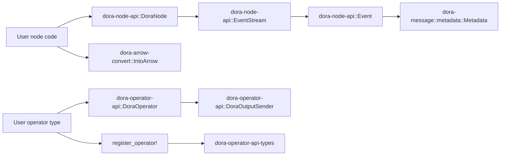

对开发者的价值：可以迅速区分“主 API”“便捷 API”“兼容性敏感 API”，这对依赖方式和二开风险判断都很重要。  
关键源码证据：`apis/rust/node/src/lib.rs`；`apis/rust/operator/src/lib.rs`；`apis/rust/operator/types/src/lib.rs`；`libraries/core/src/lib.rs`；`libraries/message/src/lib.rs`；`libraries/arrow-convert/src/lib.rs`。  
待确认项：哪些公开 item 被维护者视为“正式稳定承诺”，哪些只是因为当前实现便利而公开，源码中未见显式稳定性分级说明。  

## 7. 核心类型、trait、泛型、生命周期与约束

### 7.1 节点侧核心对象

#### `DoraNode`

- 代表一个已经接入 Dora 的节点句柄。
- 内部持有 `NodeId`、`DataflowId`、`NodeRunConfig`、control channel、时钟、共享内存缓存与 drop token 状态。
- 发送方法都要求 `&mut self`，这说明它不是“纯只读句柄”，而是带内部状态推进的发送端。

#### `EventStream`

- 是节点的输入侧句柄。
- 支持同步 `recv()`、异步 `recv_async()`、超时变体和 `try_recv()`。
- 文档明确指出：默认接收路径会通过 `EventScheduler` 做公平性重排，因此“接收顺序”不是简单的原始到达顺序。

#### `Event`

- `#[non_exhaustive]`。
- 关键变体：`Input`、`InputClosed`、`NodeFailed`、`Stop`、`Reload`、`Error`。
- 对使用者意味着：`match` 必须保留兜底分支，不能假定未来不会增加新事件。

### 7.2 operator 侧核心对象

#### `DoraOperator`

- trait 约束：`Default`。
- 核心方法：

```rust
fn on_event(
    &mut self,
    event: &Event,
    output_sender: &mut DoraOutputSender,
) -> Result<DoraStatus, String>;
```

- 含义：operator 可以持有内部状态，但必须可默认构造。
- 对使用者意味着：实例化逻辑不能依赖自定义构造参数，初始化策略要么走 `Default`，要么通过运行时事件或外部全局状态注入。

#### `Event<'a>`

- `Input` / `InputClosed` 的 ID 是借用数据，因此有生命周期参数 `'a`。
- `ArrowData` 本身是拥有型包装，但字符串 ID 借自底层 FFI 输入。
- 对使用者意味着：不要把 `event` 里的借用字符串跨回调保存；如需长期持有，应拷贝成 `String`。

#### `DoraOutputSender<'a>`

- 借用底层 `SendOutput`，只在回调期间有效。
- 对使用者意味着：不应该把它存入长期状态中；它是典型的“调用期 capability”。

### 7.3 支撑层关键类型

- `dora-message::Metadata`：输入输出上的参数与类型信息中心。
- `MetadataParameters = BTreeMap<String, Parameter>`：说明参数是字符串键的开放字典，而不是固定字段。
- `Parameter`：元数据参数的值类型。
- `ArrowTypeInfo`：Arrow 类型元数据。
- `DataflowId` / `SessionId` / `BuildId`：协议级身份标识。
- `IntoArrow`：把 Rust 值转成 Arrow 数组的核心 trait，带关联类型 `A: Array`。
- `RequestReplyLayer`：关联类型风格的抽象 trait，允许替换地址、请求、回复和错误类型。

### 7.4 所有权、借用与线程安全

- `DoraNode` 没有在 API 文档中显式承诺 `Send` / `Sync`，实际使用模式是单所有者、可变借用发送。
- `EventStream` 典型用法也是单消费端。
- 节点内部存在 `unsafe impl Send/Sync for ShmemHandle` 与 `MappedInputData`，但这是内部实现，不应被外部误读为“所有相关对象天然可跨线程共享”。
- `SessionId` / `BuildId` 明确实现了 `Copy + Clone + Eq + Ord + Hash`，适合作为协议级轻量值对象。

### 7.5 async runtime 绑定专题

- `EventStream::recv()` 实际上是 `block_on(self.recv_async())` 的同步包装。
- `dora-tracing::init_tracing_subscriber` 明确要求调用时已经进入 Tokio runtime。
- `examples/rust-dataflow/node/src/main.rs` 先手工构建 Tokio runtime，再调用 `init_tracing`。

对开发者的价值：理解类型设计背后的所有权和生命周期语义，能减少 operator 回调误用、跨线程误解和调度层踩坑。  
关键源码证据：`apis/rust/node/src/node/mod.rs`；`apis/rust/node/src/event_stream/event.rs`；`apis/rust/node/src/event_stream/mod.rs`；`apis/rust/operator/src/lib.rs`；`libraries/message/src/metadata.rs`；`libraries/arrow-convert/src/lib.rs`。  
待确认项：`DoraNode`、`EventStream` 在未来是否会显式声明 `Send` / `Sync` 语义，源码里未看到稳定承诺。  

## 8. feature flags 与 `cfg` 条件编译

### 8.1 feature matrix 概览

| crate | 默认 feature | 非默认 feature | feature 影响 |
| --- | --- | --- | --- |
| `dora-node-api` | `tracing`, `metrics` | 同左 | `init_tracing` 仅在 `tracing` 时导出；`metrics` / `tracing` 会启用内部遥测分支。 |
| `dora-core` | 无 | `build`, `zenoh` | `build` 暴露 `build` 模块并引入 `git2` / `url`；`zenoh` 启用 `topics` 中的 Zenoh 会话与 topic 函数。 |
| `dora-ros2-bridge` | `generate-messages` | `generate-messages` | 生成并暴露 `messages` 模块，同时启用 build-dependency `dora-ros2-bridge-msg-gen` 和 `rust-format`。 |
| `communication-layer-request-reply` | 无 | 无 | 无运行 feature，但有显式 docs.rs 构建元数据。 |
| `dora-tracing` | 无 | 无 | 通过环境变量决定 OTLP 与 stdout/file 行为，不依赖 Cargo feature。 |
| `dora-metrics` | 无 | 无 | 通过运行时初始化启用。 |

### 8.2 `dora-node-api`：默认 feature 的实际影响

- `tracing`：`apis/rust/node/src/lib.rs` 中的 `pub use node::init_tracing` 仅在 `#[cfg(feature = "tracing")]` 下导出。
- `metrics`：`apis/rust/node/src/node/mod.rs` 中存在 `#[cfg(feature = "metrics")]` 分支，说明内部有条件的指标初始化路径。
- `default-features = false`：主节点 API 仍可工作，但遥测 helper 不再默认可见。

### 8.3 `dora-core`：构建能力与分布式能力分离

- `build`：激活 `pub mod build`，并引入 `git2` 与 `url`。
- `zenoh`：激活 `topics.rs` 里一整组 `open_zenoh_session*` 与 topic 构造函数。

### 8.4 `dora-ros2-bridge`：默认开启消息生成

- `default = ["generate-messages"]`
- `messages` 模块本体来自 `include!(env!("MESSAGES_PATH"))`
- `--no-default-features` 时，`messages` 模块不再暴露，使用方式会明显变化。

### 8.5 `cfg` 平台差异

#### Unix

- `dora-node-api::daemon_connection` 支持 `UnixDomain`。
- `event_stream`、`control_channel`、`drop_stream` 存在 Unix 条件分支。
- `dora-download` 在 Unix 上把下载后的文件设为可执行。

#### Windows

- `register_operator!` 在 Windows 上写入 `.drectve` 导出段，确保静态链接到 C++ DLL 时仍然可导出符号。
- workspace CI 与 cross-check 明确覆盖 Windows 构建，但 Unix domain socket 路径不适用。

#### ROS2

- `dora-ros2-bridge` 的 CI 示例只在 Ubuntu 22.04 上配合 ROS2 Humble 跑通。
- README 里存在更宽的支持矩阵，但从源码与 CI 能直接确认的仍以 Ubuntu + ROS2 workflow 为主。

### 8.6 文档差异

- `communication-layer-request-reply` 是当前唯一明确配置 docs.rs `all-features = true` 和 `rustdoc-args = ["--cfg", "docsrs"]` 的 crate。
- 其它 crate 没有显式 docs.rs metadata，这意味着 feature-gated API 在文档中可能失真，尤其是 `dora-node-api::init_tracing` 与 `dora-ros2-bridge::messages`。

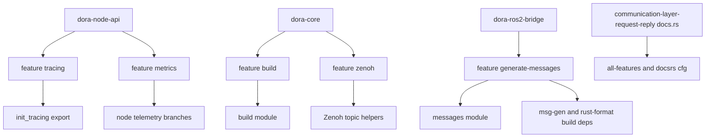

对开发者的价值：feature 和 `cfg` 决定了 API 是否存在、行为是否变、文档是否可信，先看清矩阵比“默认 cargo build 一次”更重要。  
关键源码证据：`apis/rust/node/Cargo.toml`；`apis/rust/node/src/lib.rs`；`apis/rust/node/src/node/mod.rs`；`libraries/core/Cargo.toml`；`libraries/core/src/lib.rs`；`libraries/core/src/topics.rs`；`libraries/extensions/ros2-bridge/Cargo.toml`；`libraries/extensions/ros2-bridge/src/lib.rs`；`libraries/communication-layer/request-reply/Cargo.toml`。  
待确认项：docs.rs 上各 crate 当前是否都能成功构建，需要以实际发布页为准；本地源码只确认了 manifest 配置与 crate-level 文档现状。  

## 9. 错误模型与边界行为

### 9.1 节点侧错误模型

- 初始化、发送和分配大多使用 `eyre::Result`。
- `EventStream::recv_async_timeout` 超时时会生成 `Event::Error("Receiver timed out")` 风格的错误事件，而不是抛出异常式返回。
- `send_output*` 先走 `validate_output`；若输出 ID 不在 node 配置里且不是 interactive 模式，会记录一次 warning，然后返回 `Ok(())`，即“忽略但不失败”。

### 9.2 operator 侧错误模型

- 用户回调签名是 `Result<DoraStatus, String>`。
- `Err(String)` 会被包装成 `DoraResult::from_error(error)` 并把状态设为 `DoraStatus::Stop`。
- `RawEvent` 中若 `input.data_array` 已被消费，再次消费会返回 `"data already taken"` 错误。
- Arrow FFI 解析失败不会 panic，而是转成 `Event::InputParseError`。

### 9.3 协议与兼容错误

- `dora-message::check_version_compatibility` 用 semver 检查远端消息版本是否兼容本地 crate 版本。
- 不兼容时返回明确错误，而不是静默降级。

### 9.4 panic / unwrap 策略

- 核心节点 / operator 路径主流设计是返回 `Result` 而不是 panic。
- 但仍存在内部 `unwrap()`，例如 tracing filter 指令构造和当前 crate 版本解析。
- examples 中存在 `unwrap()`，这些不应被误认为 public API 对 panic 的正式承诺。

### 9.5 输入校验与非法状态

- 节点输出 ID 校验：非法时 warning + ignore。
- operator context：通过裸指针传递，错误指针属于未定义行为风险，而不是常规 `Result` 错误。
- shared memory / Arrow FFI：一旦长度、指针或 schema 不匹配，可能升级为 soundness 问题，而不是普通业务错误。

对开发者的价值：知道哪些问题会以 `Result` 暴露，哪些只是 warning，哪些已经跨到 ABI 和 soundness 风险层，有助于设计自己的错误处理策略。  
关键源码证据：`apis/rust/node/src/node/mod.rs` 中 `validate_output` 与 `send_output*`；`apis/rust/node/src/event_stream/mod.rs` 中 `recv_async_timeout`；`apis/rust/operator/src/raw.rs`；`apis/rust/operator/types/src/lib.rs`；`libraries/message/src/lib.rs`。  
待确认项：节点输出 ID 被忽略时是否还有额外的 telemetry 或 daemon 级别反馈，当前直接证据只看到 warning。  

## 10. 关键使用流程

### 10.1 典型节点流程：`init_from_env -> EventStream -> send_output`

```mermaid
sequenceDiagram
    participant Main as "node main"
    participant API as "DoraNode::init_from_env"
    participant Daemon as "dora-daemon"
    participant Stream as "EventStream"
    participant Loop as "user event loop"

    Main->>API: "init_from_env()"
    API->>Daemon: "Register and fetch node config"
    API-->>Main: "DoraNode and EventStream"
    loop "for each event"
        Loop->>Stream: "recv() or recv_async()"
        Stream-->>Loop: "Event::Input or Stop or Error"
        Loop->>API: "send_output(output_id, metadata.parameters, data)"
        API->>Daemon: "send output via control channel"
    end
```

源码映射：

- 初始化：`apis/rust/node/src/node/mod.rs` 中 `init_from_env`
- daemon 注册：`apis/rust/node/src/daemon_connection/mod.rs` 中 `register`
- 事件接收：`apis/rust/node/src/event_stream/mod.rs` 中 `recv` / `recv_async`
- 输出发送：`apis/rust/node/src/node/mod.rs` 中 `send_output`

### 10.2 平台 / ABI 差异流程：`register_operator! -> runtime 动态装载 -> raw::dora_on_event`

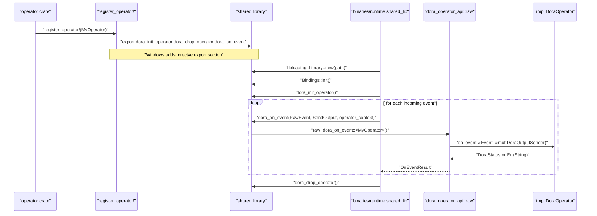

源码映射：

- 宏展开：`apis/rust/operator/macros/src/lib.rs`
- runtime 动态装载：`binaries/runtime/src/operator/shared_lib.rs`
- raw FFI 转换：`apis/rust/operator/src/raw.rs`
- ABI 类型：`apis/rust/operator/types/src/lib.rs`

对开发者的价值：把文档里的抽象 API 映射回真实运行链路，尤其适合排查“为什么节点这样初始化”“为什么 operator 必须导出这三个符号”。  
关键源码证据：`apis/rust/node/src/node/mod.rs`；`apis/rust/node/src/event_stream/mod.rs`；`apis/rust/node/src/daemon_connection/mod.rs`；`apis/rust/operator/macros/src/lib.rs`；`apis/rust/operator/src/raw.rs`；`binaries/runtime/src/operator/shared_lib.rs`。  
待确认项：shared-lib operator 在未来是否会支持 reload，目前 runtime 明确跳过 `Event::Reload`。  

## 11. `unsafe` / soundness / invariants

### 11.1 `dora-node-api` 的共享内存零拷贝边界

#### 位置

- `apis/rust/node/src/event_stream/data_conversion.rs`
- `apis/rust/node/src/event_stream/mod.rs`
- `apis/rust/node/src/node/mod.rs`

#### 为什么需要 `unsafe`

- 通过 `arrow::buffer::Buffer::from_custom_allocation` 把共享内存或 `AVec` 包装成 Arrow buffer。
- 通过共享内存映射读取输入数据。
- 为内部共享内存句柄 `ShmemHandle`、映射数据 `MappedInputData` 手工声明 `Send` / `Sync`。

#### 依赖的不变量

- `shared_memory_id` 和 `len` 必须与实际共享内存区域匹配。
- `from_custom_allocation` 提供的指针和长度必须指向有效、生命周期足够长的底层内存。
- 共享内存切片访问不能越界。
- `Send` / `Sync` 只有在底层共享内存映射和访问模式满足线程安全时才成立。

#### 调用方前提

- 对外调用方通常通过 `DoraNode::allocate_data_sample` 与 `EventStream` 间接使用这些路径，不应自行构造这些内部类型。
- 不要假设可以随意跨线程共享 `DataSample` 或底层映射，只因为内部实现做了 `Send` / `Sync`。

#### 潜在风险

- 长度不匹配可能造成越界读。
- 共享内存底层释放时序若被破坏，可能产生悬垂引用。
- `unsafe impl Send/Sync` 一旦与底层实际线程模型不符，可能触发未定义行为。

### 11.2 `dora-operator-api` 的 raw FFI 边界

#### 位置

- `apis/rust/operator/src/raw.rs`
- `apis/rust/operator/types/src/lib.rs`
- `apis/rust/operator/macros/src/lib.rs`

#### 为什么需要 `unsafe`

- 从 `operator_context: *mut c_void` 恢复用户 operator 实例。
- 从 Arrow FFI 结构恢复 Arrow 数据。
- 通过 `slice::from_raw_parts` 从裸字节指针读取 operator 输出数据。
- 导出 `extern "C"` 符号并在 Windows 写入链接导出指令。

#### 依赖的不变量

- `operator_context` 必须来自 `dora_init_operator::<O>`，并且只按相同 `O` 解释。
- `dora_drop_operator` 只能调用一次。
- `RawEvent` 里的 `data_array` / `schema` 必须是有效 Arrow FFI 对。
- `dora_send_operator_output` 的 `data_ptr` / `data_len` 必须指向有效字节数组。
- Windows `.drectve` 中的导出名必须与 runtime 查找名一致。

#### 调用方前提

- 对纯 Rust operator 作者来说，应尽量只实现 `DoraOperator` 并使用 `register_operator!`，不要直接依赖 `raw`。
- 只有在编写跨语言或底层 ABI 工具时，才应直接使用 `dora-operator-api-types`。

#### 潜在风险

- 错误类型恢复、重复释放、悬垂裸指针、无效 Arrow schema，都可能升级为 UB。
- `Event<'a>` 借用 ID 文本，若用户错误保留借用，也可能越过 safe facade 的设计预期。

### 11.3 其它 crate 中的 `unsafe`

- `dora-core::metadata` 也存在 `unsafe` 数组 / 指针解析逻辑。
- `dora-ros2-bridge` 与 `dora-ros2-bridge-msg-gen` 存在较多 FFI / raw memory 操作。
- C / C++ / Python 绑定层也广泛使用 `unsafe`，但这些不属于本份文档的主 API 分析重点。

### 11.4 结论

- 不能说“仓库里 unsafe 很少”。
- 更准确的说法是：对最终 Rust 用户最重要的 unsafe 边界集中在“节点共享内存零拷贝”和“operator ABI”两条主线。

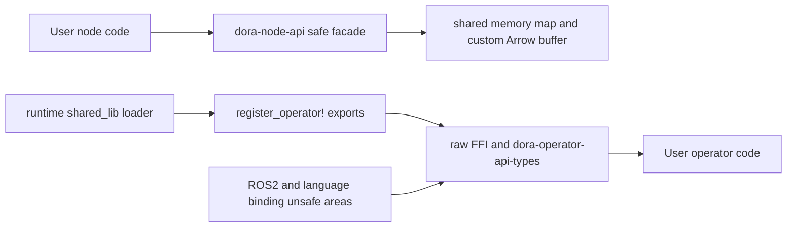

对开发者的价值：明确 safe facade 的边界在哪里，什么时候可以安心用高层 API，什么时候必须把问题当成 ABI 与内存安全问题处理。  
关键源码证据：`apis/rust/node/src/event_stream/data_conversion.rs`；`apis/rust/node/src/node/mod.rs`；`apis/rust/operator/src/raw.rs`；`apis/rust/operator/types/src/lib.rs`；`apis/rust/operator/macros/src/lib.rs`。  
待确认项：是否存在额外的 unsafe 审计文档、Miri 检查或 soundness issue 跟踪，仓库中未直接看到。  

## 12. 性能、内存与并发模型

### 12.1 节点输出路径

- `ZERO_COPY_THRESHOLD = 4096`。
- 当输出字节数大于等于阈值且不是 interactive 模式时，`DoraNode::allocate_data_sample` 会走共享内存。
- 否则使用 `AVec<u8, ConstAlign<128>>` 的对齐向量。

这说明节点发送面同时追求：

- 小数据的低管理开销。
- 大数据的共享内存零拷贝传输。

### 12.2 输入路径

- `EventStream::data_to_arrow_array` 会把 `DataMessage::Vec` 或 `DataMessage::SharedMemory` 转成 Arrow array。
- 共享内存输入路径通过 `MappedInputData::map` 和 `Buffer::from_custom_allocation` 避免额外复制。

### 12.3 operator 路径

- runtime 从 operator 动态库拿到 `Output` 后，会通过 `arrow::ffi::from_ffi` 读取 Arrow 数据，再拷贝进 `AVec` 样本后转成 `OperatorEvent::Output`。
- 这说明 shared-lib operator 边界不是完全零拷贝到终点；至少 runtime 内部还存在一次样本重打包。

### 12.4 并发与同步

- 节点 API 混合同步和异步接口。
- 遥测层里有 `Arc<Mutex<Option<OtelGuard>>>`，并依赖 Tokio runtime。
- `flume` 被广泛用作跨线程 / 跨组件通道。
- 共享内存句柄、drop token 和 event scheduler 说明并发不是简单的“单线程无状态事件循环”。

### 12.5 明显热点

- Arrow FFI 转换。
- 大样本共享内存映射与回收。
- event scheduler 的公平性重排。
- telemetry 打开时的上下文传播与 exporter flush。
- ROS2 bridge 的消息生成与 FFI 数据转换。

### 12.6 benchmark 证据

- workspace 没有独立 `benches/` 目录。
- CI 有单独 `bench` job，执行 `cargo run --example benchmark --release`。
- 因此当前性能门禁更像“benchmark example”而不是基于 Criterion 的稳定 bench 套件。

对开发者的价值：理解“什么时候会复制、什么时候会共享内存、哪里会重排事件”，能帮助你设计节点负载、延迟与调试策略。  
关键源码证据：`apis/rust/node/src/node/mod.rs` 中 `ZERO_COPY_THRESHOLD` / `allocate_data_sample`；`apis/rust/node/src/event_stream/mod.rs`；`apis/rust/node/src/event_stream/data_conversion.rs`；`binaries/runtime/src/operator/shared_lib.rs`；`.github/workflows/ci.yml` 的 `bench` job。  
待确认项：是否存在独立于 example 的内部基准工具或 profiling 文档，仓库中未直接发现。  

## 13. tests / doctest / examples / benches

### 13.1 doctest 与 crate docs

- `dora-node-api` crate-level docs 自带初始化与事件处理示例。
- `integration_testing` 模块文档给出了三种测试模式与示例代码。

### 13.2 单元测试

- `dora-operator-api::raw` 有单元测试，验证 open telemetry context 会从输入传播到输出。
- `dora-core` 的 `build`、`descriptor::validate` 有 `#[cfg(test)]` 分支。
- `dora-ros2-bridge-msg-gen` 多个 parser / types 模块有单元测试。

### 13.3 集成测试

- `libraries/message/tests/node_exit_status.rs` 验证 `NodeExitStatus` 在 Unix / Windows 下的分类不变量。
- `libraries/arrow-convert/tests/conversion_test.rs` 做了大量 Arrow round-trip 转换测试。

### 13.4 examples

- `examples/rust-dataflow/node/src/main.rs` 是节点最小路径。
- `examples/rust-dataflow/node/src/tests.rs` 同时演示：
  - 通过 `setup_integration_testing` 测试 `main`
  - 直接用 `DoraNode::init_testing`
  - 通过 channel 检查样本输出
- workspace examples job 还会实际运行 `rust-dataflow`、`rust-dataflow-git`、`multiple-daemons`、`c-dataflow`、`cxx-dataflow` 等例子。

### 13.5 benches

- 没有独立 `benches/` 目录。
- `examples/benchmark` 既是例子也是性能回归入口。

### 13.6 当前缺口

- 未见 `cargo doc` 或 rustdoc example 编译门禁。
- 未见 SemVer API diff 测试。
- 未见 `cargo-audit`、`cargo-deny`、fuzz、Miri。
- feature 组合测试不够系统，尤其是 `no-default-features` 与 docs.rs 视角。

对开发者的价值：能快速找到“可直接拿来学”的例子，也能知道现有测试主要保护哪些行为、哪些风险还没有自动化覆盖。  
关键源码证据：`apis/rust/node/src/lib.rs`；`apis/rust/node/src/integration_testing.rs`；`apis/rust/operator/src/raw.rs`；`libraries/message/tests/node_exit_status.rs`；`libraries/arrow-convert/tests/conversion_test.rs`；`examples/rust-dataflow/node/src/tests.rs`；`.github/workflows/ci.yml`。  
待确认项：是否还有未纳入 workspace 的外部 benchmark 仓库或 nightly-only 测试套件，本仓库只直接确认了 example-based benchmark。  

## 14. 二次开发与扩展点

### 14.1 推荐扩展点

- 实现 `DoraOperator`。
- 基于 `DoraNode` / `EventStream` 编写节点。
- 通过 `IntoArrow` 添加自己的 Arrow 友好输入输出类型。
- 使用 `DescriptorExt`、`NodeExt` 之类的扩展 trait 做配置工具链。
- 使用 `RequestReplyLayer` 抽象新增请求应答后端。
- 使用 `TracingBuilder` 添加额外 subscriber layer。

### 14.2 有条件的扩展点

- `dora-operator-api-types`：适合生成头文件或跨语言桥接，但不适合作为一般业务逻辑层依赖。
- `dora-ros2-bridge`：适合已有 ROS2 生态接入。
- `dora-download`：适合 runtime / plugin 类流程，不适合作为泛用下载工具的长期中心依赖。

### 14.3 不建议依赖的内部细节

- `dora-operator-api::raw`
- `dora-node-api` 内部共享内存细节
- `dora-ros2-bridge::_core` 的具体内部结构
- runtime 对动态库的装载顺序与私有 `Bindings` 实现
- `arrow_utils` 中未明确稳定的底层复制工具

### 14.4 扩展时最容易破坏的约束

- 输出 ID 必须与 descriptor 中声明一致。
- operator 不能破坏 `Default` 构造与 ABI 符号导出约束。
- 不能把 `Event<'a>` 的借用字段跨回调长期保存。
- 不能假设 event scheduler 保持原始顺序。
- 不能绕过 `Metadata` / `ArrowTypeInfo` 直接拼装不一致的数据载荷。

对开发者的价值：知道哪里是官方鼓励的扩展点，哪里只是“代码上能碰到但不建议绑定”的内部细节。  
关键源码证据：`apis/rust/operator/src/lib.rs`；`apis/rust/operator/types/src/lib.rs`；`libraries/communication-layer/request-reply/src/lib.rs`；`libraries/core/src/descriptor/mod.rs`；`libraries/extensions/telemetry/tracing/src/lib.rs`。  
待确认项：维护者是否计划把 `RequestReplyLayer`、`arrow_utils`、`_core` 等列入稳定扩展面，源码中没有正式分级。  

## 15. 源码阅读建议、技术债与易踩坑点

### 15.1 新开发者第一周阅读顺序

1. 根 `Cargo.toml`，理解 workspace 结构。
2. `apis/rust/node/src/lib.rs`，抓住节点 API 正门。
3. `apis/rust/node/src/node/mod.rs`，理解初始化与发送。
4. `apis/rust/node/src/event_stream/event.rs` 与 `event_stream/mod.rs`，理解事件与调度。
5. `examples/rust-dataflow/node/src/main.rs` 与 `tests.rs`，把 API 用法映射到真实代码。
6. `apis/rust/operator/src/lib.rs`、`raw.rs`、`macros/src/lib.rs`、`types/src/lib.rs`，补齐 operator 线。
7. `libraries/message/src/common.rs`、`config.rs`、`metadata.rs`，理解协议和元数据。
8. `libraries/core/src/descriptor/mod.rs`，理解数据流描述。

### 15.2 明显技术债

- docs.rs 策略不统一，只有少数 crate 显式配置 docs.rs 元数据。
- workspace 版本 `0.5.0` 与 `Changelog.md` 最新可见 release 标签 `v0.3.14` 不一致，发布叙事存在断层。
- `dora-message` 独立版本化增加了灵活性，也提高了兼容性与发布心智成本。
- operator FFI 契约存在，但面向维护者的 ABI 文档不足。
- benchmark 仍依赖 example，而不是更细粒度的基准套件。

### 15.3 易踩坑点

- `Event` / `StopCause` 是非穷尽枚举，`match` 必须有兜底。
- `EventStream::recv*` 默认可能重排事件。
- 输出 ID 写错时不是报错，而是 warning + ignore。
- `DoraNode::init_from_env` 在测试模式和交互模式下有分支，排查初始化问题时要先看环境变量。
- `register_operator!` 不是语法糖，而是 ABI 导出入口；忘写就会导致 runtime 找不到符号。
- `dora-ros2-bridge` 默认 feature 会影响 `messages` 模块是否存在。

### 15.4 最该补齐的文档点

- operator ABI 契约与 symbol 约束。
- re-export facade 的稳定性分级。
- docs.rs feature / target 策略。
- `dora-message` 独立版本升级指南。
- shared memory / zero-copy 的内存模型说明。

对开发者的价值：把最容易浪费时间的“读源码顺序”和“隐藏坑”提前说清楚，可以显著缩短上手周期。  
关键源码证据：根 `Cargo.toml`；`Changelog.md`；`apis/rust/node/src/*`；`apis/rust/operator/src/*`；`libraries/message/src/*`；`libraries/core/src/descriptor/mod.rs`。  
待确认项：版本与 changelog 的不一致是否只是当前分支状态，还是发布流程长期现象，需要维护者确认。  

# 第二部分：面向维护者

## 1. Cargo 元数据与发布资产

### 1.1 workspace 级元数据

根 `Cargo.toml` 的 `[workspace.package]` 已统一给出：

- `edition = "2024"`
- `rust-version = "1.85.0"`
- `version = "0.5.0"`
- `description`
- `documentation = "https://dora-rs.ai"`
- `readme = "./README.md"`
- `license = "Apache-2.0"`
- `repository = "https://github.com/dora-rs/dora/"`

这让大多数 crate 可以直接 `*.workspace = true` 继承元数据。

### 1.2 主要 crate 的元数据完整性

- `dora-node-api`、`dora-operator-api`、`dora-core`、`dora-message`、`dora-arrow-convert`、`dora-tracing`、`dora-metrics`、`dora-download`、`communication-layer-request-reply`：元数据整体较完整。
- `dora-core` 使用自己的 `README.md`，而不是 workspace 根 README。
- `dora-ros2-bridge` 有 `description`、`license`、`documentation`、`readme`、`links`，但 manifest 中未看到 `repository`。
- `dora-ros2-bridge-msg-gen` 有 `description`、`authors`、`license`，但 manifest 中未看到 `documentation`、`readme`、`repository`。

### 1.3 仓库级发布资产

已确认存在：

- `README.md`
- `Changelog.md`
- `LICENSE`
- `NOTICE.md`
- `dist-workspace.toml`
- `install.sh` / `install.ps1`
- `.github/workflows/release.yml`
- `.github/workflows/cargo-release.yml`

### 1.4 版本叙事风险

- manifest 当前基线是 `0.5.0`。
- `Changelog.md` 最新可见条目是 `v0.3.14` / `v0.3.13`。
- 这意味着“源码版本号”“对外 release 记录”“可能的分支状态”之间存在可见落差，维护者需要额外说明。

对维护者的价值：这部分直接回答“发布资产齐不齐、哪个 crate 元数据不完整、版本叙事是否一致”这三个维护基础问题。  
关键源码证据：根 `Cargo.toml`；各目标 crate `Cargo.toml`；`README.md`；`Changelog.md`；`LICENSE`；`.github/workflows/release.yml`；`.github/workflows/cargo-release.yml`。  
待确认项：当前仓库快照是否来自尚未发布的 `0.5.0` 开发阶段，如果是，应在 release note 或文档首页说明。  

## 2. SemVer / MSRV / 兼容性承诺

### 2.1 当前已确认策略

- MSRV：`1.85.0`。
- edition：`2024`。
- CI 有专门的 `msrv` job，使用 `cargo hack check --rust-version --workspace --ignore-private --locked`。
- `dora-message` 独立版本化，当前是 `0.8.0`，并提供 `check_version_compatibility`。

### 2.2 兼容性边界

以下改动高度可能构成 breaking change：

- `dora-node-api` 和 `dora-operator-api` 的 re-export 路径变化。
- `DoraOperator` trait 方法签名变化。
- `dora-operator-api-types` 的结构体字段、枚举布局、导出函数签名变化。
- `Event` / `StopCause` / `DoraStatus` 语义重写。
- 默认 feature 变更，尤其是 `dora-node-api` 的 `tracing` / `metrics` 与 `dora-ros2-bridge` 的 `generate-messages`。
- `dora-message` 的版本兼容规则变化。

### 2.3 `#[non_exhaustive]` 的正面作用

- `dora-node-api::Event`
- `dora-node-api::StopCause`

这降低了“新增枚举变体”的 SemVer 压力，是当前 API 设计里比较成熟的兼容性手法。

补充说明：

- `dora-operator-api::Event<'a>` 当前**没有**标记为 `#[non_exhaustive]`，因此若后续新增变体，会比节点侧事件枚举更容易形成 breaking change。

### 2.4 `dora-message` 独立版本的双刃剑

优点：

- 可以独立演进消息格式。
- 协议兼容性被显式建模。

风险：

- 需要维护额外的升级心智模型。
- workspace lockstep 发布与消息协议版本不能简单等同。

### 2.5 【推断】建议的显式兼容承诺

- 对 `dora-node-api` / `dora-operator-api` 采用 SemVer，并把 re-export 视为 public contract。
- 对 `dora-operator-api-types` 明确“Rust API 兼容性”和“ABI 兼容性”是两套承诺。
- 对 `_core`、`raw`、`arrow_utils`、`types` 等低层模块增加稳定性分级注释。

对维护者的价值：帮助你明确哪些看似普通的修改其实会产生 API 或 ABI 破坏，哪些地方已经有设计缓冲。  
关键源码证据：根 `Cargo.toml` 的 `rust-version`；`.github/workflows/ci.yml` 的 `msrv` job；`libraries/message/src/lib.rs` 中 `check_version_compatibility`；`apis/rust/node/src/event_stream/event.rs`；`apis/rust/operator/src/lib.rs`。  
待确认项：仓库中未见正式的 SemVer policy 文档，因此“哪些公开项被承诺稳定”仍需维护者补充。  

## 3. docs.rs / rustdoc 策略

### 3.1 当前状态

- `dora-node-api`：crate-level docs 较完整，是当前最接近“能直接上 docs.rs 给用户看”的 crate。
- `dora-operator-api`：有基础说明，但 ABI、宏、`types` 与 `raw` 的文档深度不足。
- `dora-core`、`dora-operator-api-macros`、`dora-operator-api-types`、`dora-ros2-bridge-msg-gen`：从源码看，crate 首页和公开面不匹配的问题更明显。

### 3.2 docs.rs metadata

- 已确认显式设置 `[package.metadata.docs.rs]` 的只有 `communication-layer-request-reply`。
- 该 crate 还启用了 `#![cfg_attr(docsrs, feature(doc_auto_cfg))]`。
- 其余目标 crate 当前未在 manifest 中声明 docs.rs feature / target / rustdoc 参数。

### 3.3 可能失真的点

- `dora-node-api::init_tracing` 是 feature-gated 导出，但未见 `doc(cfg)`。
- `dora-ros2-bridge::messages` 由 build 时生成并由 feature 控制，docs.rs 若没有特定配置，文档极易失真或构建失败。
- `dora-operator-api-macros` 的真正行为在宏展开结果，而不是函数签名本身；仅靠 rustdoc 首页很难解释完整。

### 3.4 维护建议

- 至少给 `dora-node-api`、`dora-operator-api`、`dora-core`、`dora-operator-api-types`、`dora-ros2-bridge` 加上 docs.rs metadata。
- 为 feature-gated item 增加 `doc(cfg)` 或等价展示。
- 在 CI 增加关键 crate 的 `cargo doc --no-deps` 或 docs.rs 风格 dry-run。
- 为 operator ABI 和 shared memory 边界补充 rustdoc 示例或模块级文档。

对维护者的价值：这部分能帮助你判断“当前文档站的可信度”以及“哪个 crate 最需要先补 rustdoc”。  
关键源码证据：`apis/rust/node/src/lib.rs`；`apis/rust/operator/src/lib.rs`；`apis/rust/operator/macros/src/lib.rs`；`apis/rust/operator/types/src/lib.rs`；`libraries/communication-layer/request-reply/Cargo.toml`；`libraries/communication-layer/request-reply/src/lib.rs`。  
待确认项：各 crate 在 docs.rs 上的实际构建状态与 feature 展示情况，需要以发布页面为准。  

## 4. CI、lint、测试与质量门禁

### 4.1 已有门禁

`.github/workflows/ci.yml` 当前覆盖：

- `cargo check --all`
- `cargo build --all`
- `cargo test --all`
- workspace examples 运行
- ROS2 bridge examples
- benchmark example
- CLI 端到端测试
- `cargo clippy --all`
- `cargo fmt --all -- --check`
- `cargo lichking check`
- `typos`
- `cross` 多 target `cargo check`
- `cargo hack` 的 MSRV 检查

### 4.2 覆盖面亮点

- 三大主平台：Linux、macOS、Windows。
- 多 target cross-check。
- examples 不是只编译，而是真运行。
- CLI workflow 会创建模板项目并实际执行 `dora run`。
- ROS2 有专门 workflow job，不和普通例子混在一起。

### 4.3 当前缺失

- 未见 `cargo doc` / rustdoc 构建门禁。
- 未见 `cargo-semver-checks`。
- 未见 `cargo-audit`。
- 未见 `cargo-deny`。
- clippy 的 feature-specific job 已写但被 `if: false` 禁用。
- 未见针对 `no-default-features` / `all-features` 的关键 crate 测试矩阵。

### 4.4 相关自动化

- `regenerate-schemas.yml` 会自动运行 `cargo run -p dora-core --bin generate_schema` 并在 schema 变化时开 PR。
- `cargo-update.yml` 每周自动 `cargo update` 并提交 `Cargo.lock` 更新草稿 PR。
- 同一个 workflow 还会尝试自动 `cargo clippy --fix` 并开 PR。

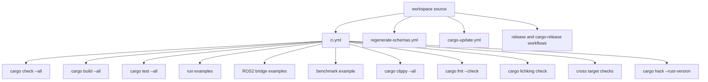

对维护者的价值：这是当前质量门禁的“事实地图”，可以直接拿来判断哪些问题已经被机器兜底，哪些还没有。  
关键源码证据：`.github/workflows/ci.yml`；`.github/workflows/regenerate-schemas.yml`；`.github/workflows/cargo-update.yml`。  
待确认项：是否还有外部 CI、nightly 任务或第三方发布流水线没有放在本仓库。  

## 5. 依赖管理与 feature 组合维护

### 5.1 依赖分层

#### 核心依赖

- Arrow 家族：`arrow`、`arrow-data`、`arrow-schema`、`arrow-json`
- 异步与通道：`tokio`、`futures`、`flume`
- 配置与序列化：`serde`、`serde_yaml`、`serde_json`
- 错误处理：`eyre`

#### 可选依赖

- `dora-node-api`：`dora-tracing`、`dora-metrics`
- `dora-core`：`git2`、`url`、`zenoh`
- `dora-ros2-bridge`：`dora-ros2-bridge-msg-gen`、`rust-format`

#### build-dependencies

- `dora-operator-api-macros`：`syn`、`quote`、`proc-macro2`
- `dora-ros2-bridge`：消息生成器和代码格式化器

#### dev-dependencies

- examples、CLI、runtime、tempfile、assert2 等贯穿多个 crate 和 workspace job

### 5.2 风险点

- telemetry 依赖版本有漂移：`dora-node-api` manifest 里出现 `opentelemetry = 0.23.0` 的可选依赖，而 `dora-tracing` / `dora-metrics` 使用 `0.31.x`；即使当前未直接暴露，也值得维护者统一审视。
- `dora-ros2-bridge` 将 `rustdds` 钉在 `=0.11.4`，并在注释里说明因为上游 issue。
- `git2` 使用 `vendored-openssl`，这会影响构建时长、二进制大小和供应链审查路径。
- workspace 很大，虽然单 crate feature 不算爆炸，但“跨 crate 的平台 / 语言 / 扩展组合”本身就是组合复杂度来源。

### 5.3 维护建议

- 对 `dora-node-api`、`dora-core`、`dora-ros2-bridge` 维护显式 feature matrix。
- 对 telemetry 版本做一次统一性审查。
- 保留 `Cargo.lock` 自动更新，但增加变更摘要与关键 crate smoke test。
- 对 pinned 依赖建立 issue 链接与解锁条件。

对维护者的价值：让依赖升级不再只是“跑一次 cargo update”，而是知道哪些依赖会动 ABI、文档、平台和供应链。  
关键源码证据：各目标 crate `Cargo.toml`；`.github/workflows/cargo-update.yml`；`libraries/extensions/ros2-bridge/Cargo.toml` 中对 `rustdds` 的固定版本注释。  
待确认项：`dora-node-api` 中 `opentelemetry = 0.23.0` 的可选依赖是否仍在有效使用，需结合更大范围源码确认。  

## 6. 跨平台 / target 支持矩阵

### 6.1 可直接确认的 CI 目标

- Linux、macOS、Windows：常规 build/test/examples/CLI。
- cross-check：
  - `x86_64-unknown-linux-gnu`
  - `i686-unknown-linux-gnu`
  - `aarch64-unknown-linux-gnu`
  - `aarch64-unknown-linux-musl`
  - `armv7-unknown-linux-musleabihf`
  - `x86_64-pc-windows-gnu`
  - `aarch64-apple-darwin`
  - `x86_64-apple-darwin`

### 6.2 源码中的平台特定 API

- Unix：`DaemonChannel::UnixDomain`，control channel / drop stream / node communication 的 Unix 分支。
- Windows：operator 宏的 `.drectve` 导出段；多处 example / CLI 自更新目标分支。
- Linux / ROS2：ROS2 bridge workflow 只在 Ubuntu 22.04 Humble 跑。

### 6.3 未见证据的方向

- 未发现 wasm 支持。
- 未发现 `no_std` / `alloc` only 路径。
- README 提到的 Android / iOS 只在宣传层出现，当前源码与 CI 证据不足以把它们写成已确认支持。

### 6.4 最值得进 CI 的组合

- `dora-node-api`：默认、`--no-default-features`
- `dora-core`：默认、`--features build`、`--features zenoh`
- `dora-ros2-bridge`：默认、`--no-default-features`
- Windows operator shared lib export smoke test
- docs.rs 风格文档构建

对维护者的价值：平台支持矩阵直接决定 issue triage、PR 评审范围和 release 宣传口径。  
关键源码证据：`.github/workflows/ci.yml`；`apis/rust/node/src/daemon_connection/mod.rs`；`apis/rust/operator/macros/src/lib.rs`；`libraries/extensions/download/src/lib.rs`。  
待确认项：README 中更宽的 OS/架构支持矩阵与当前 CI 覆盖是否仍完全一致，需要维护者校准。  

## 7. 弃用、迁移与变更管理

### 7.1 已确认的弃用信号

源码中能直接看到的 `#[deprecated]` 很少：

- CLI 中有 `use run instead` 的 deprecated 命令入口。
- `dora-tracing` 的 `telemetry.rs` 中存在 `#[deprecated(since = "0.3.14", note = "Use init_tracing instead")]`。

这说明仓库不是完全不用弃用机制，但它还不是一个被系统化执行的 crate API 迁移策略。

### 7.2 CHANGELOG 的局限

- `Changelog.md` 是 repo 级流水账，适合看整体演进。
- 但对 crate 维护而言，它不够精确：
  - 没有按 crate 分节
  - 没有 feature / ABI / SemVer 分类
  - 不足以让 `dora-node-api` 使用者快速判断升级影响

### 7.3 建议的迁移策略

- 公开 Rust API 先 `deprecated`，再移除。
- re-export 变更先给迁移窗口。
- `dora-operator-api-types` 若改 ABI，应在 release note 中单列“ABI breaking”。
- `dora-message` 若改兼容规则，应同步更新 `check_version_compatibility` 的说明和升级文档。

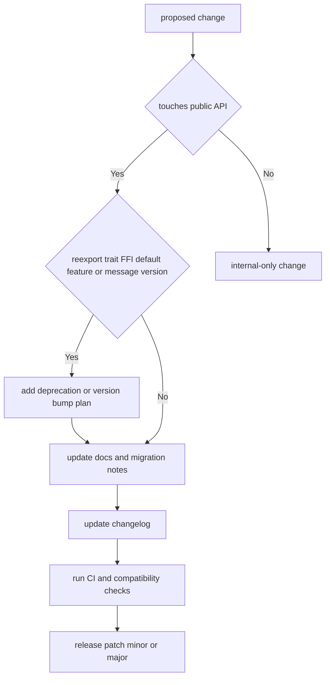

对维护者的价值：把“变更管理”从 release 当天的紧急决定，前移成一个可重复执行的流程。  
关键源码证据：`libraries/extensions/telemetry/tracing/src/telemetry.rs`；`binaries/cli/src/command/run.rs`；`Changelog.md`。  
待确认项：仓库外是否存在更正式的 release note 或迁移指南模板，本仓库内未直接看到。  

## 8. 安全、许可证、审计与合规

### 8.1 高风险区域

- `unsafe` 与 FFI：节点共享内存、operator ABI、ROS2 bridge、C/C++/Python 绑定。
- 动态库加载：`binaries/runtime/src/operator/shared_lib.rs` 使用 `libloading::Library::new`。
- 远端下载：runtime 可通过 `dora-download::download_file` 下载 operator 动态库。
- 配置与协议输入：YAML / JSON / Arrow FFI / shared memory 元数据。
- 构建与外部命令：`dora-core` 的 `run`、`build` feature、git/url 支持。

### 8.2 许可证与依赖检查

- workspace 主许可证是 `Apache-2.0`。
- CI 已有 `cargo lichking check`。
- 但未见 `cargo deny` 或更细粒度 licenses 配置。

### 8.3 建议的安全门禁

- `cargo audit`
- `cargo deny`（advisories + licenses + bans）
- 对 `dora-operator-api-types` 和 `dora-node-api` 关键 unsafe 路径做专门审计清单
- 对“下载远端动态库”的信任模型做额外文档说明

### 8.4 当前最值得审查的模块

1. `apis/rust/node/src/event_stream/data_conversion.rs`
2. `apis/rust/node/src/node/mod.rs`
3. `apis/rust/operator/src/raw.rs`
4. `apis/rust/operator/types/src/lib.rs`
5. `binaries/runtime/src/operator/shared_lib.rs`
6. `libraries/extensions/ros2-bridge/src/*`

对维护者的价值：明确指出“最该花审计预算的地方”，而不是把所有 crate 一视同仁地平均分配注意力。  
关键源码证据：`apis/rust/node/src/event_stream/data_conversion.rs`；`apis/rust/operator/src/raw.rs`；`apis/rust/operator/types/src/lib.rs`；`binaries/runtime/src/operator/shared_lib.rs`；`.github/workflows/ci.yml` 的 `check-license` job。  
待确认项：是否存在私有安全审计、依赖白名单或供应链流程，本仓库未看到对应配置文件。  

## 9. 发布流程、回滚与补丁策略

### 9.1 当前发布流程

仓库实际上有两条并行发布线：

#### GitHub Release / 安装器产物

- `release.yml` 基于 `cargo-dist` 构建并上传 GitHub Release 产物。

#### crates.io 发布

- `cargo-release.yml` 在 release published 后执行。
- 通过 `publish_if_not_exists` 按顺序发布 crate。

### 9.2 crates.io 发布顺序

当前脚本顺序大致是：

1. `dora-message`
2. libraries crates
3. Rust API crates
4. binaries crates
5. ROS2 bridge crates

其中 `dora-message` 因独立版本可能已发布，脚本允许“已存在则跳过”。

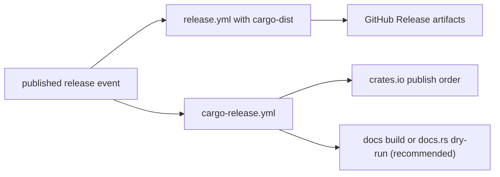

### 9.3 发布前检查建议

- 对主入口 crate 运行 docs 构建。
- 明确检查 `dora-node-api` / `dora-operator-api` 的 feature 组合。
- 复核 `Changelog.md` 与 manifest 版本是否一致。
- 对 operator ABI 改动做 smoke test。

### 9.4 失败处理与回滚

- `publish_if_not_exists` 使得部分成功后可重复运行 workflow。
- 若 crates.io 已发布错误版本，常规手段是 `yank`，而不是重发同版本。
- GitHub Release 产物由 `cargo-dist` 负责，若 installer 或 archive 有问题，可能需要重新发布 tag 或修复 release 资产。

### 9.5 patch / minor / major 建议

- patch：实现缺陷、文档修复、非破坏性内部优化。
- minor：新增 API、增加 feature、扩展示例或可选后端。
- major：re-export 变更、trait 签名变化、FFI 布局变化、默认 feature 变化、消息兼容策略变化。

对维护者的价值：发布链路、失败恢复与版本分类是 maintainer 最常执行的高风险操作，这部分要能直接拿来当检查清单。  
关键源码证据：`.github/workflows/release.yml`；`.github/workflows/cargo-release.yml`；`dist-workspace.toml`；根 `Cargo.toml`。  
待确认项：是否存在人工 release checklist、tag 约定和 crates.io 发布权限分工，本仓库未直接看到。  

## 10. 维护风险、交接建议与优先事项

### 10.1 当前最大维护风险

- workspace 广度大，既有 Rust API，又有多语言绑定、runtime、daemon、扩展、ROS2、安装器与 CI 自动化。
- operator ABI 与 shared memory 零拷贝路径都带 `unsafe`，出问题时排查成本高。
- `dora-message` 独立版本化使协议兼容与 workspace 发布脱钩。
- docs.rs / rustdoc 策略不统一，容易出现“源码真实状态”和“外部文档认知”偏差。

### 10.2 新 maintainer 最先掌握什么

1. 根 `Cargo.toml` 与 crate 分层。
2. `dora-node-api` 的初始化、事件流与发送路径。
3. `dora-operator-api` 的宏 / raw / types / runtime 装载链。
4. `dora-message` 的消息类型与版本兼容检查。
5. release / cargo-release / CI workflows。

### 10.3 最该优先补齐的自动化

- `cargo-semver-checks`
- `cargo doc` / docs.rs 风格构建
- `cargo audit`
- `cargo deny`
- 关键 crate 的 feature matrix 测试

### 10.4 最该优先补齐的文档

- operator ABI 说明
- re-export 稳定性分级
- `dora-message` 升级指南
- docs.rs / feature / target 文档策略
- 共享内存不变量说明

对维护者的价值：如果你是接手者，这一节就是最短的“带班材料”；如果你是现 maintainer，这一节就是优先级清单。  
关键源码证据：整份 workspace 结构；`apis/rust/node/src/*`；`apis/rust/operator/src/*`；`libraries/message/src/lib.rs`；`.github/workflows/*`。  
待确认项：当前 maintainer 团队的职责划分、review owner 与发布权限分布，源码仓库中没有直接配置说明。  

# 第三部分：面向 AI 的代码索引卷

这一部分不是按“人类从头到尾阅读”的叙述方式写，而是按“AI 代理如何稳定检索、排序、跳转、回答问题”来组织。主文档负责解释高价值线索与阅读顺序；全量索引则放在 `docs/dora-rust-workspace-ai-index.jsonl`，schema 放在 `docs/dora-rust-workspace-ai-index.schema.yaml`。

## 1. 索引目标、范围与排除项

### 1.1 索引目标

本索引优先服务以下查询场景：

- “节点侧入口在哪里，先看哪些文件？”
- “`DoraOperator` / `register_operator` / `RawEvent` 真正定义在哪？”
- “某个 feature 会影响哪些文件、模块、符号？”
- “哪里用了 `unsafe` / FFI / proc-macro / build.rs / platform cfg？”
- “哪个 test / example 最适合回答某个行为问题？”
- “发布、docs.rs、CI 门禁应该看哪几个文件？”

### 1.2 已索引范围

当前机器导出覆盖 `361` 个 `file_record` 与 `789` 个 `symbol_record`。按文件类型统计：

| file_kind | 数量 | 说明 |
| --- | --- | --- |
| `source` | 176 | Rust 源码、crate root、模块实现、FFI 与 proc-macro 代码。 |
| `example` | 100 | `examples/*` 下的 Rust 示例、README、`run.rs`、dataflow YAML 与示例 crate manifest。 |
| `test` | 10 | `tests/*` 与 crate 内显式测试入口。 |
| `build` | 7 | `build.rs` 文件。 |
| `ci` | 11 | `.github/workflows/*`。 |
| `config` | 45 | `Cargo.toml`、`Cargo.lock`、YAML/TOML/Nix/安装脚本等。 |
| `doc` | 12 | `README`、`Changelog`、`LICENSE`、`NOTICE`、`CONTRIBUTING`。 |

Rust 项目中要求覆盖的文件类型已经纳入：

- `Cargo.toml` / `Cargo.lock`
- `src/**/*.rs`
- `tests/**/*.rs`
- `examples/**/*.rs`
- `build.rs`
- `README.md` / `CHANGELOG.md` / `Changelog.md` / `LICENSE`
- `.github/workflows/*.yml`
- 与构建、发布、文档、质量门禁直接相关的 `*.toml` / `*.yaml` / `*.nix` / `*.sh` / `*.ps1`

### 1.3 排除项

以下路径或产物不进入当前 AI 索引范围：

- `target/`
- `.git/`
- 本次生成的索引产物：`docs/dora-rust-workspace-ai-index.jsonl`、`docs/dora-rust-workspace-ai-index.schema.yaml`
- 未落在上述模式里的缓存、二进制产物、第三方下载物
- 非 Rust 主线的外部生成产物与临时文件

### 1.4 边界说明

- “每个文件至少出现一次”是指每个**被索引范围纳入**的文件至少有一条 `file_record`。
- 对跨 crate 调用图、宏展开后的真实符号位置、`used_by_files` 的精确结果，当前采取保守策略；无法静态可靠确认时不虚构。
- 当前仓库未见独立 `benches/` 目录；性能场景主要通过 `examples/benchmark/*` 与 CI 中的 benchmark example 体现。

对开发者/维护者的价值：先定义清楚“索引覆盖什么、不覆盖什么”，后续检索结果才不会混入缓存、生成物或无关文件。  
关键源码证据：`Cargo.toml`；`.github/workflows/*.yml`；`docs/dora-rust-workspace-ai-index.jsonl` 的统计结果。  
待确认项：若仓库后续加入独立 `benches/`、额外 schema 产物或新的语言绑定目录，需要同步更新索引范围规则。  

## 2. workspace / crate / module / file 全量地图

### 2.1 workspace 分层地图

从 AI 检索角度看，这个 workspace 可以按“公开入口层 / 支撑层 / 扩展层 / 上下文层”切分：

| 层次 | crate / 目录 | 主要职责 | AI 首选入口 |
| --- | --- | --- | --- |
| 公开入口层 | `apis/rust/node` | 节点侧 Rust public API facade。 | `apis/rust/node/src/lib.rs` |
| 公开入口层 | `apis/rust/operator` | operator safe API、trait、输出发送。 | `apis/rust/operator/src/lib.rs` |
| 公开入口层 | `apis/rust/operator/macros` | `register_operator!` proc-macro 与导出符号生成。 | `apis/rust/operator/macros/src/lib.rs` |
| ABI 支撑层 | `apis/rust/operator/types` | `repr(C)` FFI 类型、Arrow FFI、头文件生成。 | `apis/rust/operator/types/src/lib.rs` |
| 协议与配置层 | `libraries/message`、`libraries/core` | 消息协议、配置 schema、descriptor、topics、构建辅助。 | `libraries/message/src/lib.rs`、`libraries/core/src/lib.rs` |
| 数据桥接层 | `libraries/arrow-convert`、`libraries/communication-layer/request-reply` | Arrow 类型转换、请求应答抽象。 | `libraries/arrow-convert/src/lib.rs`、`libraries/communication-layer/request-reply/src/lib.rs` |
| 扩展层 | `libraries/extensions/*` | 下载、tracing、metrics、ROS2 bridge 及 message generator。 | 各 crate `src/lib.rs` / `build.rs` |
| 运行时上下文层 | `binaries/runtime`、`binaries/daemon`、`binaries/cli` | 为 API 提供运行时装载、测试和例子执行上下文。 | `binaries/runtime/src/operator/shared_lib.rs` 等 |
| 回归与示例层 | `examples/*`、`tests/*` | 最小路径、行为边界、跨语言与多平台场景。 | `examples/rust-dataflow/*`、`tests/example-tests.rs` |

### 2.2 crate / module / file 映射图

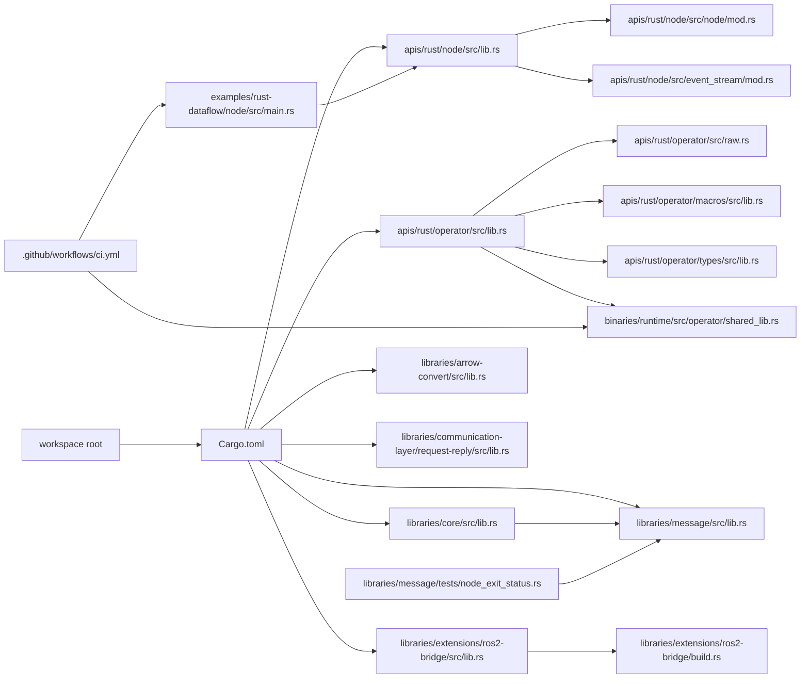

### 2.3 供 AI 使用的优先阅读路径

1. 节点 API：`Cargo.toml` -> `apis/rust/node/Cargo.toml` -> `apis/rust/node/src/lib.rs` -> `apis/rust/node/src/node/mod.rs` -> `apis/rust/node/src/event_stream/mod.rs`
2. operator API：`apis/rust/operator/Cargo.toml` -> `apis/rust/operator/src/lib.rs` -> `apis/rust/operator/src/raw.rs` -> `apis/rust/operator/types/src/lib.rs` -> `apis/rust/operator/macros/src/lib.rs` -> `binaries/runtime/src/operator/shared_lib.rs`
3. 协议与配置：`libraries/message/src/lib.rs` -> `libraries/message/src/common.rs` / `config.rs` / `metadata.rs` -> `libraries/core/src/lib.rs`
4. feature / cfg：各 crate `Cargo.toml` -> 对应 `src/lib.rs` -> 命中的 `cfg` 子模块
5. 例子与回归：`examples/rust-dataflow/node/src/main.rs` -> `examples/rust-dataflow/node/src/tests.rs` -> `tests/example-tests.rs` -> `.github/workflows/ci.yml`

### 2.4 “完整文件树”落点

严格意义上的“文件级全量地图”已经落在 `docs/dora-rust-workspace-ai-index.jsonl` 的 `file_record.file_path` 字段中。主文档不重复铺开 361 行路径，而是提供：

- workspace 级阅读骨架
- crate 与模块职责
- 高优先级文件卡
- 查询意图到文件的路由表

对开发者/维护者的价值：先知道“层次”和“起点”，AI 才能把问题路由到正确 crate，而不是在 binaries、examples、扩展层之间盲搜。  
关键源码证据：`Cargo.toml` 的 workspace members；各 crate `src/lib.rs`；`binaries/runtime/src/operator/shared_lib.rs`；`examples/rust-dataflow/node/src/main.rs`；`libraries/message/tests/node_exit_status.rs`。  
待确认项：若后续新增 workspace member crate，`docs/dora-rust-workspace-ai-index.jsonl` 的 crate map 需要重新导出。  

## 3. 文件级索引总表

### 3.1 总表承载方式

文件级索引总表不直接塞进主文档，而是以全量 `JSONL` 承载：

- 全量文件记录：`docs/dora-rust-workspace-ai-index.jsonl`
- 记录类型：`record_type = "file_record"`
- 稳定字段：`file_path`、`file_kind`、`crate`、`module_path`、`role`、`one_line_summary`、`key_symbols`、`depends_on_files`、`depended_by_files`、`feature_flags`、`cfg_conditions`、`unsafe_present`、`search_keywords`、`typical_queries`

这意味着：

- 每个被纳入索引范围的文件至少出现一次
- 普通文件可用最小索引字段回答“它是干什么的”
- 核心文件再由本节下一章的“增强版文件卡”补高密度解释

### 3.2 AI 读取文件级总表的推荐顺序

| 查询类型 | 首选过滤字段 | 典型筛选 |
| --- | --- | --- |
| 入口定位 | `role`、`file_kind`、`module_path` | `crate-root`、`workspace-manifest`、`binary-entrypoint` |
| API 所在文件 | `key_symbols`、`crate` | 查 `DoraNode`、`DoraOperator`、`register_operator` |
| feature 影响 | `feature_flags`、`cfg_conditions` | 查 `tracing`、`metrics`、`build`、`zenoh`、`generate-messages` |
| unsafe / FFI 热点 | `unsafe_present`、路径关键词 | `operator/types`、`operator/raw`、`node/event_stream/data_conversion` |
| 测试 / 示例 | `file_kind`、`file_path` | `example`、`test`、`run.rs`、`dataflow.yml` |
| 发布 / CI | `file_kind = ci` 或 `config/doc` | `.github/workflows/*`、`Cargo.toml`、`Changelog.md` |

### 3.3 代表性 file_record 示例

| file_path | file_kind | crate | role | one_line_summary |
| --- | --- | --- | --- | --- |
| `Cargo.toml` | `config` | `dora-examples` | `workspace-manifest` | workspace members、统一元数据、root examples 与 dev-dependencies。 |
| `apis/rust/node/src/lib.rs` | `source` | `dora-node-api` | `crate-root` | 节点侧 public API facade 与 crate-level docs。 |
| `apis/rust/operator/src/raw.rs` | `source` | `dora-operator-api` | `source` | safe trait facade 到 raw FFI ABI 的桥接实现。 |
| `libraries/core/Cargo.toml` | `config` | `dora-core` | `crate-manifest` | `build` / `zenoh` feature 定义与依赖边界。 |
| `libraries/extensions/ros2-bridge/build.rs` | `build` | `dora-ros2-bridge` | `build-script` | `generate-messages` feature 下的生成逻辑。 |
| `libraries/message/tests/node_exit_status.rs` | `test` | `dora-message` | `test` | 协议层集成测试。 |
| `.github/workflows/ci.yml` | `ci` | `dora-examples` | `ci-workflow` | `check/build/test/examples/clippy/fmt/license/cross/MSRV` 主门禁。 |

### 3.4 主文档与 JSONL 的关系

- 主文档负责高价值解释与人工优先级。
- JSONL 负责“全量 + 稳定 + 可解析”。
- 如果 AI 系统支持分层检索，建议先用 JSONL 做召回，再回主文档读取增强卡与风险说明。

对开发者/维护者的价值：文件级总表把“所有文件都有去处”这件事固定下来，后续排查 API、feature、CI、测试时不必再手工翻目录。  
关键源码证据：`docs/dora-rust-workspace-ai-index.jsonl` 中的 `file_record`；`docs/dora-rust-workspace-ai-index.schema.yaml`。  
待确认项：若未来要加入 `used_by_files` 的精确依赖分析，应考虑基于 `rust-analyzer` 或语义级索引，而不是仅靠轻量静态扫描。  

## 4. 文件级详细索引卡

下列文件是“文件级总表”的增强版卡片，优先覆盖用户指定的 manifest、crate root、re-export 文件、unsafe 文件、build.rs、tests、examples 与关键 CI 文件。

### 4.1 `Cargo.toml`

- 文件路径：`Cargo.toml`
- 文件类型：`config`
- 所属 crate：`dora-examples`，同时承担 workspace root
- 模块路径：无
- 文件职责：定义 workspace members、统一 `version = "0.5.0"`、`rust-version = "1.85.0"`、workspace dependencies 与 root examples
- 该文件对外暴露了什么：对 Cargo、CI、发布脚本暴露整个 workspace 的 crate 拓扑、版本基线和 examples 入口
- 该文件定义了哪些关键符号：workspace members；`dora-message = "0.8.0"`；root `[[example]]`
- 该文件依赖谁：所有 path dependency manifest
- 谁依赖该文件：整个 workspace 的 build/test/release/metadata 流程
- 涉及哪些 feature / cfg / target：workspace 自身无 feature；examples 入口依赖各 member crate feature
- 是否包含 unsafe / ffi / proc_macro / 宏导出 / build 脚本逻辑：否
- 对应的典型查询问题：`workspace 入口在哪里`；`版本基线是什么`；`有哪些 member crate`
- 建议阅读前置文件：无
- 相关文件：`apis/rust/node/Cargo.toml`；`apis/rust/operator/Cargo.toml`；`libraries/core/Cargo.toml`
- 关键源码证据：`[workspace]`、`[workspace.package]`、`[workspace.dependencies]`、`[[example]]`
- 待确认项：`Changelog.md` 与 `0.5.0` 版本叙事未完全对齐

### 4.2 `apis/rust/node/src/lib.rs`

- 文件路径：`apis/rust/node/src/lib.rs`
- 文件类型：`source`
- 所属 crate：`dora-node-api`
- 模块路径：`crate`
- 文件职责：节点侧 crate root、crate-level docs、public API facade、re-export 汇聚点
- 该文件对外暴露了什么：`DoraNode`、`EventStream`、`Event`、`StopCause`、`DataSample`、`ZERO_COPY_THRESHOLD`、`integration_testing`、`init_tracing`
- 该文件定义了哪些关键符号：`DaemonCommunicationWrapper`；`pub use node::{DataSample, DoraNode, ZERO_COPY_THRESHOLD, arrow_utils}`
- 该文件依赖谁：`node/mod.rs`、`event_stream/mod.rs`、`integration_testing.rs`
- 谁依赖该文件：所有 Rust 节点、examples、tests、绑定层 crate
- 涉及哪些 feature / cfg / target：`#[cfg(feature = "tracing")] pub use node::init_tracing`
- 是否包含 unsafe / ffi / proc_macro / 宏导出 / build 脚本逻辑：无直接 `unsafe`，但导出面覆盖共享内存路径
- 对应的典型查询问题：`DoraNode 从哪导入`；`EventStream 定义在哪`；`节点默认公开哪些外部 re-export`
- 建议阅读前置文件：`apis/rust/node/Cargo.toml`
- 相关文件：`apis/rust/node/src/node/mod.rs`；`apis/rust/node/src/event_stream/mod.rs`
- 关键源码证据：crate docs；`pub use` 列表；`pub mod integration_testing`
- 待确认项：`arrow_utils` 是否打算长期保持稳定公开面

### 4.3 `apis/rust/node/src/node/mod.rs`

- 文件路径：`apis/rust/node/src/node/mod.rs`
- 文件类型：`source`
- 所属 crate：`dora-node-api`
- 模块路径：`crate::node`
- 文件职责：`DoraNode` 初始化、输出发送、共享内存阈值、节点配置与运行时连接
- 该文件对外暴露了什么：`DoraNode`、`DataSample`、`ZERO_COPY_THRESHOLD`、`arrow_utils`
- 该文件定义了哪些关键符号：`DoraNode::init_from_env`、`init_from_node_id`、`init_testing`、`send_output*`
- 该文件依赖谁：`control_channel.rs`、`drop_stream.rs`、`arrow_utils.rs`、`daemon_connection/*`
- 谁依赖该文件：`apis/rust/node/src/lib.rs`、examples、bindings、runtime 上下文
- 涉及哪些 feature / cfg / target：`metrics`、`tracing` 条件逻辑；Unix socket 路径通过下游连接模块体现
- 是否包含 unsafe / ffi / proc_macro / 宏导出 / build 脚本逻辑：包含共享内存与 buffer 不变量相关 `unsafe`
- 对应的典型查询问题：`send_output 为什么走零拷贝`；`节点怎样初始化`；`输出 ID 校验策略是什么`
- 建议阅读前置文件：`apis/rust/node/src/lib.rs`
- 相关文件：`apis/rust/node/src/event_stream/data_conversion.rs`；`apis/rust/node/src/daemon_connection/mod.rs`
- 关键源码证据：`DoraNode` impl；`ZERO_COPY_THRESHOLD`；`validate_output`
- 待确认项：共享内存映射对跨平台行为的完整契约未见独立文档

### 4.4 `apis/rust/operator/src/lib.rs`

- 文件路径：`apis/rust/operator/src/lib.rs`
- 文件类型：`source`
- 所属 crate：`dora-operator-api`
- 模块路径：`crate`
- 文件职责：operator safe facade、`DoraOperator` trait、`Event<'a>` 与 `DoraOutputSender`
- 该文件对外暴露了什么：`register_operator`、`types`、`DoraStatus`、`DoraOperator`、`Event<'a>`、`DoraOutputSender`
- 该文件定义了哪些关键符号：`Event<'a>`；`DoraOperator` trait；`DoraOutputSender::send`
- 该文件依赖谁：`raw.rs`、`dora-operator-api-macros`、`dora-operator-api-types`
- 谁依赖该文件：operator crate、example operator、runtime 动态库 ABI 入口
- 涉及哪些 feature / cfg / target：当前未见 manifest feature；ABI 通过下游 raw/types 体现
- 是否包含 unsafe / ffi / proc_macro / 宏导出 / build 脚本逻辑：自身是 safe facade，但 `send` 内使用 Arrow FFI 转换
- 对应的典型查询问题：`operator 应实现哪个 trait`；`register_operator 从哪里来`；`send 输出时会发生什么`
- 建议阅读前置文件：`apis/rust/operator/Cargo.toml`
- 相关文件：`apis/rust/operator/src/raw.rs`；`apis/rust/operator/types/src/lib.rs`；`apis/rust/operator/macros/src/lib.rs`
- 关键源码证据：`pub use dora_operator_api_macros::register_operator`；`pub use types::DoraStatus`
- 待确认项：`raw` 与 `types` 的稳定性分级未在源码中显式标记

### 4.5 `apis/rust/operator/src/raw.rs`

- 文件路径：`apis/rust/operator/src/raw.rs`
- 文件类型：`source`
- 所属 crate：`dora-operator-api`
- 模块路径：`crate::raw`
- 文件职责：在 safe trait 和 `dora-operator-api-types` FFI ABI 之间做双向转换
- 该文件对外暴露了什么：raw ABI helper，供宏展开后的导出符号调用
- 该文件定义了哪些关键符号：`dora_init_operator`、`dora_drop_operator`、`dora_on_event`
- 该文件依赖谁：`DoraOperator` trait；`dora-operator-api-types`；Arrow FFI
- 谁依赖该文件：`register_operator!` 宏展开结果；runtime 动态库装载路径
- 涉及哪些 feature / cfg / target：无显式 feature；ABI 契约对平台无关，但由动态库装载路径体现 target 差异
- 是否包含 unsafe / ffi / proc_macro / 宏导出 / build 脚本逻辑：是；核心 raw FFI 热点
- 对应的典型查询问题：`runtime 调 operator 时到底调了谁`；`RawEvent 如何转成 safe Event`；`panic / error 怎么透传`
- 建议阅读前置文件：`apis/rust/operator/src/lib.rs`
- 相关文件：`apis/rust/operator/macros/src/lib.rs`；`apis/rust/operator/types/src/lib.rs`；`binaries/runtime/src/operator/shared_lib.rs`
- 关键源码证据：`unsafe extern "C"` helper；`Event` 转换；错误到 `DoraResult` 的映射
- 待确认项：ABI 演进是否有额外 out-of-band 兼容文档

### 4.6 `apis/rust/operator/macros/src/lib.rs`

- 文件路径：`apis/rust/operator/macros/src/lib.rs`
- 文件类型：`source`
- 所属 crate：`dora-operator-api-macros`
- 模块路径：`crate`
- 文件职责：实现 `register_operator!` proc-macro，生成 `dora_init_operator` / `dora_drop_operator` / `dora_on_event`
- 该文件对外暴露了什么：`register_operator`
- 该文件定义了哪些关键符号：`register_operator`；`register_operator_impl`
- 该文件依赖谁：`proc_macro`、`quote`、`syn`、`dora-operator-api::raw`
- 谁依赖该文件：`dora-operator-api` crate root re-export；所有 operator 实现 crate
- 涉及哪些 feature / cfg / target：`#[cfg(target_os = "windows")]` 的 `.drectve` 导出段
- 是否包含 unsafe / ffi / proc_macro / 宏导出 / build 脚本逻辑：是；proc-macro 与 Windows 链接导出热点
- 对应的典型查询问题：`register_operator 展开后生成了什么`；`Windows 为什么需要额外导出符号`
- 建议阅读前置文件：`apis/rust/operator/src/lib.rs`
- 相关文件：`apis/rust/operator/src/raw.rs`；`binaries/runtime/src/operator/shared_lib.rs`
- 关键源码证据：`#[proc_macro]`；`#[unsafe(no_mangle)]`；`#[unsafe(link_section = ".drectve")]`
- 待确认项：静态库到 C++ DLL 的完整链接约束目前只在注释里说明

### 4.7 `apis/rust/operator/types/src/lib.rs`

- 文件路径：`apis/rust/operator/types/src/lib.rs`
- 文件类型：`source`
- 所属 crate：`dora-operator-api-types`
- 模块路径：`crate`
- 文件职责：定义 `repr(C)` ABI 类型、Arrow FFI 类型桥、C 头文件生成入口
- 该文件对外暴露了什么：`DoraInitOperator`、`DoraResult`、`RawEvent`、`SendOutput`、`OnEventResult`、`DoraStatus`
- 该文件定义了哪些关键符号：`dora_read_data`、`dora_send_operator_output`、`generate_headers`
- 该文件依赖谁：`safer_ffi`、`arrow::ffi`、`dora-arrow-convert`
- 谁依赖该文件：`dora-operator-api`、C/C++ 绑定、runtime 动态装载路径
- 涉及哪些 feature / cfg / target：无显式 feature；ABI 对所有 target 敏感
- 是否包含 unsafe / ffi / proc_macro / 宏导出 / build 脚本逻辑：是；本仓库最关键的 FFI / ABI 热点之一
- 对应的典型查询问题：`operator ABI 的 C 结构长什么样`；`Arrow FFI 在哪一层转换`；`头文件怎么生成`
- 建议阅读前置文件：`apis/rust/operator/src/lib.rs`
- 相关文件：`apis/c/operator/build.rs`；`apis/c++/operator/build.rs`
- 关键源码证据：`#[repr(C)]`；`#[ffi_export]`；`unsafe extern "C"`；`generate_headers`
- 待确认项：字段级 ABI 稳定性与对齐约束缺少独立 SemVer 说明

### 4.8 `libraries/message/src/lib.rs`

- 文件路径：`libraries/message/src/lib.rs`
- 文件类型：`source`
- 所属 crate：`dora-message`
- 模块路径：`crate`
- 文件职责：协议 crate root、公共模块声明、独立版本常量与兼容性检查入口
- 该文件对外暴露了什么：`common`、`config`、`metadata` 等协议模块；`DataflowId`；`SessionId`；`BuildId`
- 该文件定义了哪些关键符号：`VERSION`；`check_version_compatibility`
- 该文件依赖谁：`semver`、`uuid`、Arrow schema/data、serde 相关组件
- 谁依赖该文件：`dora-core`、`dora-node-api`、runtime、daemon、bindings
- 涉及哪些 feature / cfg / target：当前未见 feature；版本兼容本身是维护敏感面
- 是否包含 unsafe / ffi / proc_macro / 宏导出 / build 脚本逻辑：无明显 `unsafe`
- 对应的典型查询问题：`消息协议版本如何校验`；`DataflowId 在哪定义`；`为什么它独立版本化`
- 建议阅读前置文件：`libraries/message/Cargo.toml`
- 相关文件：`libraries/message/src/common.rs`；`libraries/message/src/config.rs`；`libraries/core/src/lib.rs`
- 关键源码证据：`pub const VERSION`；`check_version_compatibility`
- 待确认项：独立版本升级策略是否存在仓库外文档

### 4.9 `libraries/extensions/ros2-bridge/build.rs`

- 文件路径：`libraries/extensions/ros2-bridge/build.rs`
- 文件类型：`build`
- 所属 crate：`dora-ros2-bridge`
- 模块路径：`build_script`
- 文件职责：在 `generate-messages` feature 下触发 ROS2 message 生成与环境探测
- 该文件对外暴露了什么：无 Rust public API，但决定 `messages` 模块是否可构建
- 该文件定义了哪些关键符号：build script 主流程与环境变量输出
- 该文件依赖谁：`dora-ros2-bridge-msg-gen`
- 谁依赖该文件：`libraries/extensions/ros2-bridge/src/lib.rs`
- 涉及哪些 feature / cfg / target：`generate-messages`
- 是否包含 unsafe / ffi / proc_macro / 宏导出 / build 脚本逻辑：build 脚本逻辑
- 对应的典型查询问题：`ROS2 messages 为什么是生成的`；`docs.rs / CI 为什么可能失真`
- 建议阅读前置文件：`libraries/extensions/ros2-bridge/Cargo.toml`
- 相关文件：`libraries/extensions/ros2-bridge/src/lib.rs`；`libraries/extensions/ros2-bridge/msg-gen/src/lib.rs`
- 关键源码证据：`generate-messages` feature 与 build dependencies
- 待确认项：不同 ROS2 发行版下的生成兼容性细节仍需实机验证

### 4.10 `examples/rust-dataflow/node/src/main.rs`

- 文件路径：`examples/rust-dataflow/node/src/main.rs`
- 文件类型：`example`
- 所属 crate：`rust-dataflow-example-node`
- 模块路径：`crate::main`
- 文件职责：最小 Rust 节点示例，展示 `DoraNode::init_from_env`、收事件、发输出
- 该文件对外暴露了什么：无 stable public API；主要作为最小使用路径证据
- 该文件定义了哪些关键符号：示例 `main`
- 该文件依赖谁：`dora-node-api`
- 谁依赖该文件：`.github/workflows/ci.yml`、开发者入门阅读路径
- 涉及哪些 feature / cfg / target：示例通常关闭默认 feature 或显式启用 `tracing`
- 是否包含 unsafe / ffi / proc_macro / 宏导出 / build 脚本逻辑：否
- 对应的典型查询问题：`最小节点怎么写`；`Event::Input 怎么处理`
- 建议阅读前置文件：`apis/rust/node/src/lib.rs`
- 相关文件：`examples/rust-dataflow/node/src/tests.rs`；`examples/rust-dataflow/run.rs`
- 关键源码证据：示例 main 流程；CI 中 `cargo run --example rust-dataflow`
- 待确认项：示例是否被视为长期稳定教学入口，需要维护者明确

### 4.11 `libraries/message/tests/node_exit_status.rs`

- 文件路径：`libraries/message/tests/node_exit_status.rs`
- 文件类型：`test`
- 所属 crate：`dora-message`
- 模块路径：`tests::node_exit_status`
- 文件职责：协议层集成测试，验证退出状态与序列化边界
- 该文件对外暴露了什么：不暴露 API，提供行为证据
- 该文件定义了哪些关键符号：测试用例
- 该文件依赖谁：`libraries/message/src/common.rs` 等协议类型
- 谁依赖该文件：CI `cargo test --all`
- 涉及哪些 feature / cfg / target：未见显式 feature
- 是否包含 unsafe / ffi / proc_macro / 宏导出 / build 脚本逻辑：否
- 对应的典型查询问题：`NodeExitStatus 行为如何被验证`；`消息协议有哪些回归用例`
- 建议阅读前置文件：`libraries/message/src/lib.rs`
- 相关文件：`libraries/message/src/common.rs`
- 关键源码证据：测试断言与被测协议类型
- 待确认项：协议兼容性是否还应补更多跨版本 fixture

### 4.12 `.github/workflows/ci.yml`

- 文件路径：`.github/workflows/ci.yml`
- 文件类型：`ci`
- 所属 crate：`dora-examples` / workspace root
- 模块路径：无
- 文件职责：主 CI 门禁，覆盖 check/build/test/examples/ROS2/clippy/fmt/license/cross/MSRV
- 该文件对外暴露了什么：对维护者暴露质量门禁与平台矩阵事实
- 该文件定义了哪些关键符号：workflow jobs、matrix、quality gates
- 该文件依赖谁：Cargo workspace、examples、ROS2 环境、cross 与 cargo hack
- 谁依赖该文件：PR、main branch、发布前信心边界
- 涉及哪些 feature / cfg / target：Linux/macOS/Windows；ROS2 Ubuntu Humble；cross target 检查
- 是否包含 unsafe / ffi / proc_macro / 宏导出 / build 脚本逻辑：否
- 对应的典型查询问题：`发布前有哪些门禁`；`哪些平台真的进 CI`；`examples 是只编译还是会运行`
- 建议阅读前置文件：`Cargo.toml`
- 相关文件：`.github/workflows/release.yml`；`.github/workflows/cargo-release.yml`
- 关键源码证据：`test`、`examples`、`ros2-bridge-examples`、`cross-check`、`msrv`
- 待确认项：仓库外是否还有未纳入的 nightly / security CI

对开发者/维护者的价值：增强卡把“该文件到底值得看什么”浓缩出来，适合人工 review，也适合 AI 在多轮问答里做稳定引用。  
关键源码证据：以上每张卡片所列源码与 workflow 文件。  
待确认项：如果要进一步细化，可把这些卡片拆成独立 `docs/cards/*.md`，再由主文档汇总。  

## 5. 符号级索引

### 5.1 全量符号索引的承载方式

- 全量符号记录位于 `docs/dora-rust-workspace-ai-index.jsonl`
- 当前记录数：`789`
- 记录类型：`record_type = "symbol_record"`
- 当前自动索引覆盖：public struct、public enum、public trait、public function、public type alias、public re-export
- 当前人工补充关注：重要内部热点符号，如 `validate_output`、`EventScheduler`、`SharedLibraryOperator`

### 5.2 高价值符号表

| symbol_name | symbol_kind | defined_in | visibility | reexported_from | 典型查询 |
| --- | --- | --- | --- | --- | --- |
| `DoraNode` | `struct` | `apis/rust/node/src/node/mod.rs` | `public` | `apis/rust/node/src/lib.rs` | 节点入口、初始化、输出发送 |
| `EventStream` | `struct` | `apis/rust/node/src/event_stream/mod.rs` | `public` | `apis/rust/node/src/lib.rs` | 事件接收、调度、公平性 |
| `Event` | `enum` | `apis/rust/node/src/event_stream/event.rs` | `public` | `apis/rust/node/src/event_stream/mod.rs`、`apis/rust/node/src/lib.rs` | 节点事件模型、`StopCause` |
| `DataSample` | `struct` | `apis/rust/node/src/node/mod.rs` | `public` | `apis/rust/node/src/lib.rs` | 零拷贝输出数据封装 |
| `DoraOperator` | `trait` | `apis/rust/operator/src/lib.rs` | `public` | 无 | operator safe trait 入口 |
| `DoraOutputSender` | `struct` | `apis/rust/operator/src/lib.rs` | `public` | 无 | operator 发输出 |
| `register_operator` | `function` / `reexport` | `apis/rust/operator/macros/src/lib.rs` | `public` | `apis/rust/operator/src/lib.rs` | proc-macro 展开、导出符号 |
| `RawEvent` | `struct` | `apis/rust/operator/types/src/lib.rs` | `public` | 无 | ABI 入参、FFI 边界 |
| `DoraStatus` | `enum` | `apis/rust/operator/types/src/lib.rs` | `public` | `apis/rust/operator/src/lib.rs` | operator 状态回传 |
| `check_version_compatibility` | `function` | `libraries/message/src/lib.rs` | `public` | 无 | 协议版本兼容 |
| `IntoArrow` | `trait` | `libraries/arrow-convert/src/lib.rs` | `public` | 无 | Rust 类型到 Arrow |
| `ArrowData` | `struct` | `libraries/arrow-convert/src/lib.rs` | `public` | 无 | Arrow 数据桥 |

### 5.3 重要内部符号热点

虽然下列符号不一定都是稳定 public API，但对回答核心流程问题很重要：

- `validate_output`：`apis/rust/node/src/node/mod.rs`
  解释输出 ID 错误为什么常表现为 warning + ignore，而不是 hard error。
- `EventScheduler`：`apis/rust/node/src/event_stream/scheduler.rs`
  解释 `EventStream::recv` 为何不是简单“按到达顺序吐出”。
- `DaemonCommunicationWrapper`：`apis/rust/node/src/lib.rs`
  解释普通运行与 integration testing 路径的切换。
- `SharedLibraryOperator`：`binaries/runtime/src/operator/shared_lib.rs`
  解释 runtime 如何装载 operator 动态库并把 `Event` 转成 `RawEvent`。

### 5.4 符号级索引的使用建议

- 查 public API：优先看 `symbol_record.defined_in`
- 查导出路径：再看 `reexported_from`
- 查 feature 门控：再看 `feature_gate` 与 `cfg_conditions`
- 查“人类语义解释”：回到本主文档第一、二部分对应 crate 章节

对开发者/维护者的价值：符号级索引解决的是“名字找得到，但定义和导出路径对不上”的问题，尤其适合 re-export facade 和 proc-macro 场景。  
关键源码证据：`apis/rust/node/src/lib.rs`；`apis/rust/node/src/node/mod.rs`；`apis/rust/operator/src/lib.rs`；`apis/rust/operator/macros/src/lib.rs`；`apis/rust/operator/types/src/lib.rs`；`libraries/message/src/lib.rs`；`libraries/arrow-convert/src/lib.rs`。  
待确认项：若后续引入更多宏导出或 trait blanket impl，建议把 impl 关系单独做成第三类 `impl_record`。  

## 6. 入口链、导出链与 re-export 映射

### 6.1 crate root 到真实定义文件

- `dora-node-api`
  `src/lib.rs` 是 facade；`DoraNode` / `DataSample` 真定义在 `src/node/mod.rs`；`Event` / `EventStream` 真定义在 `src/event_stream/*`
- `dora-operator-api`
  `src/lib.rs` 是 safe facade；`register_operator` 真定义在 `apis/rust/operator/macros/src/lib.rs`；`DoraStatus` / `RawEvent` 真定义在 `apis/rust/operator/types/src/lib.rs`
- `dora-core`
  `src/lib.rs` 直接 `pub use dora_message::{config, uhlc}`，因此使用者看到的路径和真实定义文件不同
- `dora-ros2-bridge`
  `src/lib.rs` 通过 `prelude` 和 `messages` 把生成代码与底层 `_core` 暴露给上层

### 6.2 公开 API 到真实定义的映射图

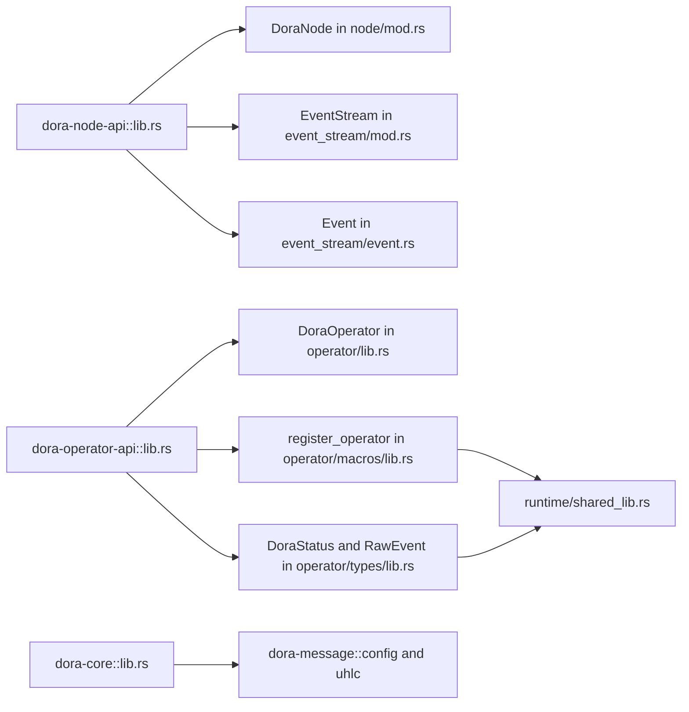

### 6.3 文件级依赖图

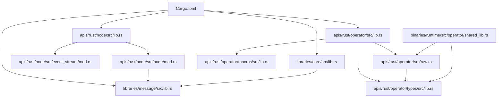

### 6.4 对 AI 检索的意义

- 当用户问“`DoraNode` 在哪”，应同时返回 facade 路径和真实定义路径
- 当用户问“`register_operator!` 为什么影响 ABI”，要把宏文件、raw FFI 文件、runtime 装载文件串起来
- 当用户问“`config` 为什么从 `dora-core` 可见”，要指出它其实 re-export 自 `dora-message`

对开发者/维护者的价值：这部分直接降低了 re-export facade 带来的路径错觉，也把 SemVer 敏感面显式标出来。  
关键源码证据：`apis/rust/node/src/lib.rs`；`apis/rust/node/src/node/mod.rs`；`apis/rust/node/src/event_stream/event.rs`；`apis/rust/operator/src/lib.rs`；`apis/rust/operator/macros/src/lib.rs`；`apis/rust/operator/types/src/lib.rs`；`binaries/runtime/src/operator/shared_lib.rs`；`libraries/core/src/lib.rs`。  
待确认项：若未来继续增加 facade 层，建议在 JSONL 里新增 `actual_definition_candidates` 字段，减少多跳解析成本。  

## 7. feature / cfg / target 到文件的映射

### 7.1 高价值 feature matrix

| feature / cfg | 入口 manifest | 主要影响文件 | 暴露差异 |
| --- | --- | --- | --- |
| `dora-node-api/default = ["tracing", "metrics"]` | `apis/rust/node/Cargo.toml` | `apis/rust/node/src/lib.rs`、`apis/rust/node/src/node/mod.rs` | `init_tracing` re-export、节点遥测初始化、metrics hook |
| `dora-node-api/tracing` | `apis/rust/node/Cargo.toml` | `apis/rust/node/src/lib.rs`、`apis/rust/node/src/node/mod.rs` | `init_tracing` 只在 feature 开启时可见 |
| `dora-node-api/metrics` | `apis/rust/node/Cargo.toml` | `apis/rust/node/src/node/mod.rs` | 节点 metrics 初始化路径 |
| `dora-core/build` | `libraries/core/Cargo.toml` | `libraries/core/src/lib.rs`、`libraries/core/src/build/*` | 构建辅助 API 与 `git2` / `url` 依赖 |
| `dora-core/zenoh` | `libraries/core/Cargo.toml` | `libraries/core/src/topics.rs` | 额外 topic helper 与日志 topic 生成函数 |
| `dora-ros2-bridge/default = ["generate-messages"]` | `libraries/extensions/ros2-bridge/Cargo.toml` | `libraries/extensions/ros2-bridge/build.rs`、`libraries/extensions/ros2-bridge/src/lib.rs` | `messages` 模块依赖 build-time 生成 |
| `dora-ros2-bridge/generate-messages` | 同上 | `build.rs`、`msg-gen/src/lib.rs` | 关闭时 `messages` 模块缺失 |
| `cfg(unix)` | `apis/rust/node/src/daemon_connection/mod.rs` | `apis/rust/node/src/daemon_connection/unix_domain.rs` | Unix domain socket 路径仅 Unix 可用 |
| `cfg(target_os = "windows")` | `apis/rust/operator/macros/src/lib.rs` | `apis/rust/operator/macros/src/lib.rs` | `.drectve` 导出段仅 Windows 需要 |
| `docs.rs metadata` | `libraries/communication-layer/request-reply/Cargo.toml` | `libraries/communication-layer/request-reply/src/lib.rs` | docs.rs 以 `all-features = true` 和 `--cfg docsrs` 构建 |

### 7.2 default / no-default-features / all-features

- `dora-node-api`
  默认启用 `tracing` 与 `metrics`；`--no-default-features` 会让 `init_tracing` 和节点指标集成不再暴露或不再生效。
- `dora-core`
  默认不带 `build` / `zenoh`；只有显式开启才会编译对应 API。
- `dora-ros2-bridge`
  默认启用 `generate-messages`；`--no-default-features` 下 `messages` 模块不再构建。
- `communication-layer-request-reply`
  docs.rs 显式 `all-features = true`，是当前已确认设置完善的 crate。

### 7.3 feature / cfg 到文件影响图

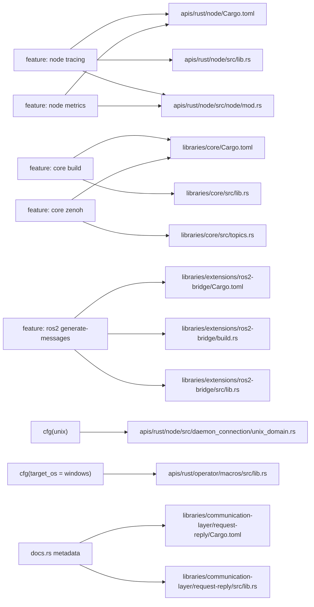

### 7.4 AI 路由建议

- 查某个 feature 的 API 差异：先看 crate `Cargo.toml`，再跳到 `src/lib.rs`
- 查 target 分支：先搜 `cfg_conditions`，再读命中的平台文件
- 查 docs.rs 差异：优先命中 `communication-layer-request-reply/Cargo.toml`

对开发者/维护者的价值：这一节把 feature、cfg、target 三种条件维度拉平到“具体哪些文件变了”，方便做兼容性判断和条件检索。  
关键源码证据：`apis/rust/node/Cargo.toml`；`apis/rust/node/src/lib.rs`；`apis/rust/node/src/node/mod.rs`；`libraries/core/Cargo.toml`；`libraries/core/src/topics.rs`；`libraries/extensions/ros2-bridge/Cargo.toml`；`libraries/extensions/ros2-bridge/build.rs`；`libraries/communication-layer/request-reply/Cargo.toml`。  
待确认项：尚未把所有 bindings / binaries 的 feature 组合纳入系统化矩阵测试，`used_by_files` 也未做 feature-aware 语义分析。  

## 8. 特殊热点索引

### 8.1 热点清单

| 热点类别 | 关键文件 | 为什么重要 | AI 检索关键词 | 关联风险 | 建议先读 |
| --- | --- | --- | --- | --- | --- |
| `unsafe` | `apis/rust/node/src/event_stream/data_conversion.rs` | 共享内存与 Arrow 数据转换 | `shared memory`、`Arrow FFI`、`zero copy` | soundness / 生命周期 / 映射不变量 | `apis/rust/node/src/node/mod.rs` |
| `unsafe` | `apis/rust/node/src/node/mod.rs` | 节点输出路径与零拷贝阈值 | `send_output`、`ZERO_COPY_THRESHOLD` | buffer 大小与对齐 | `apis/rust/node/src/lib.rs` |
| FFI | `apis/rust/operator/src/raw.rs` | safe trait 到 ABI 的转换 | `RawEvent`、`dora_on_event` | panic / 错误传播 / ABI 兼容 | `apis/rust/operator/src/lib.rs` |
| FFI | `apis/rust/operator/types/src/lib.rs` | `repr(C)` 类型与头文件生成 | `DoraResult`、`generate_headers` | ABI / 对齐 / Arrow ownership | `apis/rust/operator/src/raw.rs` |
| proc-macro | `apis/rust/operator/macros/src/lib.rs` | 生成导出符号与 Windows 链接指令 | `register_operator`、`.drectve` | 宏展开可见性与 Windows ABI | `apis/rust/operator/src/lib.rs` |
| build.rs | `libraries/extensions/ros2-bridge/build.rs` | 控制 message 生成和编译期环境 | `generate-messages` | docs.rs / CI / ROS2 环境失真 | `libraries/extensions/ros2-bridge/Cargo.toml` |
| platform-specific | `apis/rust/node/src/daemon_connection/unix_domain.rs` | Unix-only 连接实现 | `cfg(unix)`、`unix domain socket` | 平台行为差异 | `apis/rust/node/src/daemon_connection/mod.rs` |
| platform-specific | `apis/rust/operator/macros/src/lib.rs` | Windows-only 链接导出 | `target_os = windows` | DLL 符号可见性 | `binaries/runtime/src/operator/shared_lib.rs` |
| 网络 / 文件系统 / 命令执行 | `libraries/core/src/lib.rs`、`libraries/extensions/download/src/lib.rs` | 构建辅助、下载、外部命令调用 | `get_python_path`、`download_file` | 环境依赖、路径解析、供应链 | `libraries/core/Cargo.toml` |
| runtime 装载 | `binaries/runtime/src/operator/shared_lib.rs` | 动态库装载、事件转换、operator 生命周期 | `libloading`、`operator_context` | crash / panic / ABI 失配 | `apis/rust/operator/src/raw.rs` |

### 8.2 自动扫描与人工判读

自动索引里 `unsafe_present = true` 的文件当前多于核心人工关注列表，因为：

- 有些文件只是包含 `unsafe` 注释或 FFI helper
- 某些绑定层 crate 也包含 `unsafe`
- `Cargo.lock`、`Changelog.md` 等文本文件可能包含 `unsafe` 关键词，但不等于 Rust `unsafe` block

因此，AI 在回答“哪里用了 `unsafe`”时应优先返回上表中的人工确认热点，再补充 JSONL 中的全量命中结果。

### 8.3 no_std / alloc / benches 状态

- `no_std / alloc`：未发现明确支持证据
- 独立 `benches/`：未发现
- 可替代性能入口：`examples/benchmark/*`

对开发者/维护者的价值：热点索引把“高风险但高价值”的阅读路径单独拎出来，避免 AI 把普通源文件与 ABI / soundness 文件等量齐观。  
关键源码证据：`apis/rust/node/src/event_stream/data_conversion.rs`；`apis/rust/node/src/node/mod.rs`；`apis/rust/operator/src/raw.rs`；`apis/rust/operator/types/src/lib.rs`；`apis/rust/operator/macros/src/lib.rs`；`libraries/extensions/ros2-bridge/build.rs`；`binaries/runtime/src/operator/shared_lib.rs`。  
待确认项：若要把 `unsafe` 做成可审计索引，后续应引入基于 AST 的“真正 unsafe block / unsafe fn”统计，而不是仅凭关键词。  

## 9. tests / examples / benches / docs / CI 索引

### 9.1 代表性测试与示例索引

| 文件 | 类型 | 回答什么问题 |
| --- | --- | --- |
| `tests/example-tests.rs` | workspace test | workspace examples 是否都能在统一 harness 下运行 |
| `libraries/message/tests/node_exit_status.rs` | crate integration test | 协议层退出状态如何回归 |
| `examples/rust-dataflow/node/src/main.rs` | example source | 最小 Rust 节点怎么写 |
| `examples/rust-dataflow/node/src/tests.rs` | example-local test helper | 节点集成测试模式怎么用 |
| `examples/rust-dataflow/run.rs` | root example runner | Rust dataflow 场景如何由 workspace example 驱动 |
| `examples/multiple-daemons/operator/src/lib.rs` | example operator | 动态库 operator 的最小实现长什么样 |
| `examples/ros2-bridge/rust/turtle/run.rs` | ROS2 example runner | ROS2 bridge 场景怎么跑 |
| `examples/benchmark/run.rs` | benchmark example | 当前仓库如何做吞吐 / 性能场景验证 |

### 9.2 docs / CI / release 索引

| 文件 | 类型 | 回答什么问题 |
| --- | --- | --- |
| `README.md` | doc | 仓库级定位和跨语言入口 |
| `Changelog.md` | doc | 历史版本叙事与潜在迁移线索 |
| `libraries/communication-layer/request-reply/Cargo.toml` | config | 哪个 crate 现在显式配置了 docs.rs metadata |
| `.github/workflows/ci.yml` | ci | 哪些 build/test/example/MSRV/platform 真在跑 |
| `.github/workflows/release.yml` | ci | GitHub Release / cargo-dist 发布流 |
| `.github/workflows/cargo-release.yml` | ci | crates.io publish 顺序与职责 |
| `.github/workflows/regenerate-schemas.yml` | ci | schema 自动更新和 PR 生成 |
| `.github/workflows/cargo-update.yml` | ci | 依赖更新、`Cargo.lock` 漂移与自动 clippy fix |

### 9.3 benches 现状

- 未发现独立 `benches/*.rs`
- 当前与性能最相关的入口：
  `examples/benchmark/run.rs`、`examples/benchmark/node/src/main.rs`、`examples/benchmark/sink/src/main.rs`

对开发者/维护者的价值：tests/examples/docs/CI 文件分别回答“行为是否被验证”“最小路径怎么写”“发布前谁兜底”，是最常被忽略但最有导航价值的一层。  
关键源码证据：`tests/example-tests.rs`；`examples/rust-dataflow/*`；`examples/benchmark/*`；`.github/workflows/ci.yml`；`.github/workflows/release.yml`；`.github/workflows/cargo-release.yml`。  
待确认项：如果后续新增 bench harness 或单独 docs.rs smoke test，建议把它们提升为独立 `file_kind`。  

## 10. 查询关键词词典与检索路由

| query_intent | recommended_files | recommended_symbols | reason |
| --- | --- | --- | --- |
| 入口在哪里 | `Cargo.toml`；`apis/rust/node/src/lib.rs`；`apis/rust/operator/src/lib.rs` | `DoraNode`；`DoraOperator` | workspace root 与两个 Rust public API facade 是一切入口的分流点 |
| 节点最小用法 | `examples/rust-dataflow/node/src/main.rs`；`apis/rust/node/src/lib.rs` | `DoraNode`；`EventStream` | 示例 + facade 能同时回答“怎么导入”和“怎么跑” |
| operator 怎么导出 | `apis/rust/operator/src/lib.rs`；`apis/rust/operator/macros/src/lib.rs`；`apis/rust/operator/src/raw.rs` | `register_operator`；`DoraOperator`；`dora_on_event` | 宏、safe trait 和 raw ABI 三层必须一起看 |
| 错误类型定义在哪 | `apis/rust/operator/types/src/lib.rs`；`libraries/message/src/common.rs` | `DoraResult`；`NodeExitStatus` | operator ABI 错误与协议层错误分属不同 crate |
| 默认 feature 有什么影响 | `apis/rust/node/Cargo.toml`；`libraries/core/Cargo.toml`；`libraries/extensions/ros2-bridge/Cargo.toml` | `init_tracing`；Zenoh topic helpers；`messages` | manifest 决定 feature，源码决定 feature 实际命中 |
| `cfg(unix)` 影响哪 | `apis/rust/node/src/daemon_connection/mod.rs`；`apis/rust/node/src/daemon_connection/unix_domain.rs` | 无 | Unix socket 路径是最明显的 target 分支 |
| 哪里用了 unsafe | `apis/rust/node/src/event_stream/data_conversion.rs`；`apis/rust/operator/src/raw.rs`；`apis/rust/operator/types/src/lib.rs` | `dora_send_operator_output` | 这些文件是真正的 soundness / ABI 热点 |
| 协议版本兼容怎么看 | `libraries/message/src/lib.rs` | `check_version_compatibility` | `dora-message` 独立版本化的核心证据在这里 |
| docs.rs 现状怎么看 | `libraries/communication-layer/request-reply/Cargo.toml`；相关 crate `src/lib.rs` | 无 | 目前只有这个 crate 明确声明 docs.rs metadata |
| 发布顺序和回滚看哪 | `.github/workflows/cargo-release.yml`；`.github/workflows/release.yml`；`Changelog.md` | 无 | 发布流水线和版本叙事都不在源码模块里 |
| 哪个 test 覆盖这个行为 | `tests/example-tests.rs`；`libraries/message/tests/node_exit_status.rs`；example-local `tests.rs` | 无 | workspace、协议层、示例层各有不同职责 |
| 哪个 example 最接近真实路径 | `examples/rust-dataflow/run.rs`；`examples/multiple-daemons/run.rs`；`examples/ros2-bridge/rust/turtle/run.rs` | 无 | 它们分别覆盖单节点、多 daemon、ROS2 三条主线 |

对开发者/维护者的价值：这张路由表能直接变成检索系统 prompt 模板，减少“先搜哪个文件”的往返成本。  
关键源码证据：以上所有 recommended files；`docs/dora-rust-workspace-ai-index.jsonl` 中的 `search_keywords` 与 `typical_queries` 字段。  
待确认项：如果未来引入语义搜索或向量库，建议把 `query_intent` 与 `search_keywords` 做统一词表。  

## 11. 机器可读导出

### 11.1 交付物

- 全量索引：`docs/dora-rust-workspace-ai-index.jsonl`
- schema：`docs/dora-rust-workspace-ai-index.schema.yaml`

### 11.2 JSONL 记录类型

目前支持两类记录：

- `file_record`
- `symbol_record`

### 11.3 JSONL 示例

```json
{"record_type":"file_record","index_version":"1.0","generated_at":"2026-03-27T12:07:26","file_path":"apis/rust/node/src/lib.rs","file_kind":"source","crate":"dora-node-api","module_path":"crate","role":"crate-root","one_line_summary":"Crate root for dora-node-api that gathers module declarations, public exports, and crate-level docs.","key_symbols":["DataSample","DoraNode","Event","EventScheduler","EventStream","Receiver"],"depends_on_files":["apis/rust/node/src/event_stream/mod.rs","apis/rust/node/src/integration_testing.rs","apis/rust/node/src/node/mod.rs"],"depended_by_files":[],"feature_flags":["tracing"],"cfg_conditions":[],"unsafe_present":false,"search_keywords":["crate-root","dora-node-api","lib","node","rust","src"],"typical_queries":["how does dora-node-api wire this module","what does this file do","where is DataSample defined"]}
```

```json
{"record_type":"symbol_record","index_version":"1.0","generated_at":"2026-03-27T12:07:26","symbol_name":"DoraNode","symbol_kind":"struct","defined_in":"apis/rust/node/src/node/mod.rs","module_path":"crate::node","visibility":"public","reexported_from":["apis/rust/node/src/lib.rs"],"feature_gate":[],"cfg_conditions":[],"related_symbols":["DataSample","ZERO_COPY_THRESHOLD"],"used_by_files":[],"summary":"DoraNode is a struct exposed from apis/rust/node/src/node/mod.rs.","typical_queries":["where is DoraNode defined","how is DoraNode used","what API surface includes DoraNode"]}
```

### 11.4 YAML 模板

详细字段定义已单独放在 `docs/dora-rust-workspace-ai-index.schema.yaml`。其核心结构如下：

```yaml
record_types:
  - name: file_record
    required_fields:
      - file_path
      - file_kind
      - crate
      - module_path
      - role
      - one_line_summary
      - key_symbols
      - depends_on_files
      - depended_by_files
      - feature_flags
      - cfg_conditions
      - unsafe_present
      - search_keywords
      - typical_queries
  - name: symbol_record
    required_fields:
      - symbol_name
      - symbol_kind
      - defined_in
      - module_path
      - visibility
      - reexported_from
      - feature_gate
      - cfg_conditions
      - related_symbols
      - used_by_files
      - summary
      - typical_queries
```

### 11.5 推荐消费方式

1. 先读 JSONL 的 `file_record`，按 `crate` / `file_kind` / `feature_flags` / `unsafe_present` 做召回
2. 再读 `symbol_record`，按 `symbol_name` / `reexported_from` / `feature_gate` 做二跳定位
3. 最后回到本主文档的相关章节或增强卡读取解释性内容

对开发者/维护者的价值：机器可读导出让这份文档不只是“给人看”，还能直接喂给检索脚本、问答代理和 RAG pipeline。  
关键源码证据：`docs/dora-rust-workspace-ai-index.jsonl`；`docs/dora-rust-workspace-ai-index.schema.yaml`。  
待确认项：若后续需要真正语义级依赖图，可能要补充第三类记录如 `impl_record`、`callsite_record` 或 `cfg_branch_record`。  

## 12. 索引质量要求

### 12.1 当前保证

- 每个纳入索引范围的文件至少有一条 `file_record`
- 路径使用仓库相对路径，精确到文件
- `pub` / `re-export` / `feature-gated` / `platform-specific` 已做区分
- 主文档显式区分稳定 public API、内部实现、feature-gated API、平台特定 API
- 不从 README 猜 API，而以源码、manifest、CI、tests、examples 为主证据

### 12.2 当前限制

- `depends_on_files` / `depended_by_files` 目前是轻量静态关系，不是语义级调用图
- `used_by_files` 目前统一留空，避免虚构调用者
- `unsafe_present` 是关键词级标记，不等价于精确 unsafe block 审计
- `symbol_record` 目前不覆盖 impl block、trait impl 关系和宏展开后的全部生成符号
- 对 `binaries/*`、C/C++/Python 绑定采取“上下文索引而非主 API 详解”

### 12.3 建议的后续增强

- 增加 `impl_record`
- 增加 feature-aware / cfg-aware 语义依赖分析
- 把 `used_by_files` 接到 `rust-analyzer` 或语法树索引
- 为 `unsafe` 文件增加不变量摘要字段
- 为 release / migration 建立 `workflow_record` 或 `release_record`

对开发者/维护者的价值：质量要求章节定义了“这个索引能信到什么程度”，能避免把自动索引误当成完全准确的语义数据库。  
关键源码证据：`docs/dora-rust-workspace-ai-index.jsonl` 的统计结果与字段分布；本主文档第三部分的人工增强说明。  
待确认项：若未来把此索引接入自动化发布流程，需要再补“导出失败如何阻断发布”的质量门禁策略。  

# 附录

## A. ADR / 设计决策索引

仓库内未发现显式 `adr/` 或 `docs/adr/` 目录。以下是可从源码反推的“隐式设计决策”：

1. 【推断】节点数据面优先使用 Arrow，加大样本时优先走共享内存零拷贝。
2. 【推断】operator 使用动态库 ABI 而不是直接内嵌 trait object，以支持多语言与 runtime 装载。
3. 【推断】`dora-message` 独立版本化，表示协议格式演进不完全跟随 workspace lockstep。
4. 【推断】descriptor schema 由 `dora-core` 自动生成并通过 CI 保持同步。
5. 【推断】遥测默认放在可选层，通过 feature 与环境变量控制。

证据来源：`apis/rust/node/src/node/mod.rs`；`apis/rust/operator/macros/src/lib.rs`；`libraries/message/src/lib.rs`；`libraries/core/src/bin/generate_schema.rs`；`.github/workflows/regenerate-schemas.yml`。

## B. 术语表

| 术语 | 含义 |
| --- | --- |
| Dataflow | 一次运行的数据流实例。 |
| Node | 进程级执行单元。 |
| Operator | 由 runtime 装载的共享库单元。 |
| DataId | 输入输出标识。 |
| NodeId | 节点标识。 |
| OperatorId | operator 标识。 |
| DataflowId | 数据流实例唯一 ID。 |
| Metadata | 输入输出元数据与参数。 |
| ArrowData | Arrow 数组包装。 |
| DataSample | 节点发送输出时的样本缓冲。 |
| RawEvent | operator ABI 侧原始事件。 |
| DoraStatus | operator 回调控制流状态。 |
| Dynamic node | 需要手动启动的节点。 |
| MSRV | 最低支持 Rust 版本。 |
| docs.rs | Rust crate 在线文档构建与托管服务。 |

## C. Feature Matrix

| crate | feature | 默认启用 | 暴露或影响的 API / 行为 | 证据 |
| --- | --- | --- | --- | --- |
| `dora-node-api` | `tracing` | 是 | 导出 `init_tracing`，启用 tracing 分支 | `apis/rust/node/Cargo.toml`、`apis/rust/node/src/lib.rs`、`apis/rust/node/src/node/mod.rs` |
| `dora-node-api` | `metrics` | 是 | 启用 metrics 相关分支 | `apis/rust/node/Cargo.toml`、`apis/rust/node/src/node/mod.rs` |
| `dora-core` | `build` | 否 | 暴露 `build` 模块，启用 git/url 依赖 | `libraries/core/Cargo.toml`、`libraries/core/src/lib.rs` |
| `dora-core` | `zenoh` | 否 | 启用 Zenoh 会话与 topic 辅助 | `libraries/core/Cargo.toml`、`libraries/core/src/topics.rs` |
| `dora-ros2-bridge` | `generate-messages` | 是 | 暴露 `messages` 模块并触发消息生成 | `libraries/extensions/ros2-bridge/Cargo.toml`、`libraries/extensions/ros2-bridge/src/lib.rs` |
| `communication-layer-request-reply` | docs.rs config | 不适用 | docs.rs 使用 all-features + docsrs cfg | `libraries/communication-layer/request-reply/Cargo.toml` |

## D. 平台支持矩阵

| 维度 | 已确认状态 | 证据 | 备注 |
| --- | --- | --- | --- |
| Linux | 已确认 | `.github/workflows/ci.yml` | 常规 build/test/examples/CLI/ROS2 都覆盖。 |
| macOS | 已确认 | `.github/workflows/ci.yml` | 常规 build/test/examples 覆盖。 |
| Windows | 已确认 | `.github/workflows/ci.yml` | 常规 build/test/examples/CLI 覆盖；operator 宏有 Windows 导出专门逻辑。 |
| 多 target 交叉检查 | 已确认 | `.github/workflows/ci.yml` `cross-check` | 见 `aarch64` / `armv7` / `windows-gnu` / `apple-darwin`。 |
| Unix domain socket | 已确认 | `apis/rust/node/src/daemon_connection/mod.rs` | 仅 `#[cfg(unix)]`。 |
| ROS2 bridge on Ubuntu Humble | 已确认 | `.github/workflows/ci.yml` `ros2-bridge-examples` | 当前直接证据最强。 |
| wasm | 未发现证据 | 全仓搜索结果 | 【待确认】 |
| no_std / alloc | 未发现证据 | 全仓搜索结果 | 可以视为“不支持”。 |
| Android / iOS | README 提及，源码与 CI 证据不足 | `README.md` | 当前只能写【待确认】。 |

## E. 关键源码证据清单

| 文件 | 关键证据 |
| --- | --- |
| `Cargo.toml` | workspace members、统一版本、MSRV、共享依赖、examples 定义。 |
| `apis/rust/node/Cargo.toml` | `dora-node-api` 默认 features。 |
| `apis/rust/node/src/lib.rs` | 节点 crate-level docs、re-export facade。 |
| `apis/rust/node/src/node/mod.rs` | `DoraNode`、`init_from_env`、`init_from_node_id`、`init_testing`、`send_output*`、`ZERO_COPY_THRESHOLD`、`validate_output`。 |
| `apis/rust/node/src/event_stream/event.rs` | `Event` / `StopCause` 非穷尽枚举。 |
| `apis/rust/node/src/event_stream/mod.rs` | `recv*`、调度重排、共享内存输入转换。 |
| `apis/rust/node/src/integration_testing.rs` | 三种节点集成测试模式。 |
| `apis/rust/operator/src/lib.rs` | `DoraOperator` safe facade。 |
| `apis/rust/operator/src/raw.rs` | raw FFI 转换与错误传播。 |
| `apis/rust/operator/macros/src/lib.rs` | `register_operator!` 宏展开与 Windows 导出段。 |
| `apis/rust/operator/types/src/lib.rs` | ABI 类型、`repr(C)`、`safer_ffi`、头文件生成。 |
| `binaries/runtime/src/operator/shared_lib.rs` | runtime 动态装载共享库 operator 的真实链路。 |
| `libraries/core/Cargo.toml` | `build` / `zenoh` feature。 |
| `libraries/core/src/lib.rs` | `descriptor` / `topics` / `build` 暴露与辅助函数。 |
| `libraries/core/src/descriptor/mod.rs` | descriptor 扩展点。 |
| `libraries/core/src/topics.rs` | Zenoh 与平台相关 topic 帮助函数。 |
| `libraries/core/src/bin/generate_schema.rs` | schema 生成流程。 |
| `libraries/message/src/lib.rs` | 协议模块、独立版本与兼容性检查。 |
| `libraries/message/src/common.rs` | `NodeExitStatus`、`DataMessage` 等公共协议对象。 |
| `libraries/message/src/config.rs` | `NodeRunConfig` 与通信配置。 |
| `libraries/message/src/metadata.rs` | `Metadata`、`Parameter`、`ArrowTypeInfo`。 |
| `libraries/arrow-convert/src/lib.rs` | `IntoArrow` 与 `ArrowData`。 |
| `libraries/arrow-convert/tests/conversion_test.rs` | Arrow round-trip 测试。 |
| `libraries/communication-layer/request-reply/Cargo.toml` | docs.rs metadata。 |
| `libraries/communication-layer/request-reply/src/lib.rs` | 请求应答抽象 trait。 |
| `libraries/extensions/download/src/lib.rs` | 远端共享库下载行为。 |
| `libraries/extensions/telemetry/tracing/src/lib.rs` | tracing builder 与 guard。 |
| `libraries/extensions/telemetry/metrics/src/lib.rs` | metrics 初始化。 |
| `libraries/extensions/ros2-bridge/Cargo.toml` | `generate-messages` feature、ROS2 依赖与例子。 |
| `libraries/extensions/ros2-bridge/src/lib.rs` | `prelude` / `messages` / `_core` 暴露。 |
| `libraries/extensions/ros2-bridge/msg-gen/src/lib.rs` | 消息生成器公共接口。 |
| `examples/rust-dataflow/node/src/main.rs` | 最小 Rust 节点示例。 |
| `examples/rust-dataflow/node/src/tests.rs` | 节点测试模式用法。 |
| `libraries/message/tests/node_exit_status.rs` | 协议级集成测试案例。 |
| `.github/workflows/ci.yml` | 当前质量门禁与平台矩阵。 |
| `.github/workflows/release.yml` | GitHub Release / cargo-dist 流水线。 |
| `.github/workflows/cargo-release.yml` | crates.io 发布顺序。 |
| `.github/workflows/regenerate-schemas.yml` | schema 自动化。 |
| `.github/workflows/cargo-update.yml` | 依赖更新与 clippy 自动修复。 |

## F. FAQ / Troubleshooting

### Q1. 我应该先看 `dora-node-api` 还是 `dora-core`？

先看 `dora-node-api`。`dora-core` 更像配置与工具链支撑层。

### Q2. 为什么 `send_output` 写错输出 ID 也没报错？

源码里 `validate_output` 的策略是 warning + ignore。

### Q3. 为什么我的 `match Event` 编译不过未来版本？

因为 `Event` 是 `#[non_exhaustive]`，请保留兜底分支。

### Q4. 为什么 `register_operator!` 不是可选的？

因为 runtime 通过动态库符号名找 `dora_init_operator` / `dora_drop_operator` / `dora_on_event`。

### Q5. 为什么 `init_tracing` 不能直接在普通同步 main 开头调用？

因为 tracing OTLP 初始化路径需要 Tokio runtime 上下文，example 里先手工创建 runtime。

### Q6. 为什么 `EventStream::recv` 顺序看起来和到达顺序不完全一样？

因为默认接收路径使用 `EventScheduler` 做公平性重排。

### Q7. `dora-ros2-bridge` 关掉默认 feature 后为什么少了模块？

因为 `messages` 模块由 `generate-messages` feature 控制。

### Q8. `dora-message` 为什么单独版本化？

因为它承载协议格式，维护者显式允许它独立演进；兼容性通过 `check_version_compatibility` 约束。

## G. 待确认项清单

1. 当前仓库快照为何 manifest 是 `0.5.0`，而 `Changelog.md` 仍停留在 `0.3.x`。
2. docs.rs 上各目标 crate 的实际构建状态。
3. `arrow_utils`、`raw`、`types`、`_core` 的稳定性分级。
4. `dora-node-api` 中老版本 `opentelemetry` 依赖的真实用途。
5. 是否存在仓库外部 ADR、release checklist、SemVer policy 文档。
6. README 中 Android / iOS 等平台支持与当前 CI 状态的对应关系。
7. `dora-ros2-bridge::_core` 是否真的打算长期公开。
8. operator ABI 是否有额外的跨版本兼容承诺说明。

## H. 最该补齐的文档缺口 Top 10

1. `dora-operator-api` 的 ABI 与符号导出规范。
2. `dora-operator-api-types` 的字段级兼容性说明。
3. `dora-node-api` 共享内存零拷贝的不变量说明。
4. `EventStream` 调度重排的行为说明与使用建议。
5. re-export facade 的稳定性边界。
6. docs.rs feature / target 构建策略。
7. `dora-message` 独立版本升级指南。
8. `dora-ros2-bridge` 默认 feature 与生成代码路径说明。
9. workspace 版本与 changelog 版本叙事说明。
10. maintainer 用的 release checklist 与回滚手册。

对开发者/维护者的价值：附录把“证据”“矩阵”“FAQ”“待确认项”和“文档缺口”聚合在一起，适合后续持续维护与拆分。  
关键源码证据：本附录引用的全部源码与 workflow 文件。  
待确认项：若后续拆分文档，应为附录中的每个矩阵建立独立维护来源，避免主文档与分文档漂移。  
